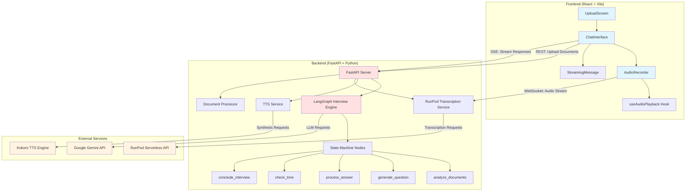
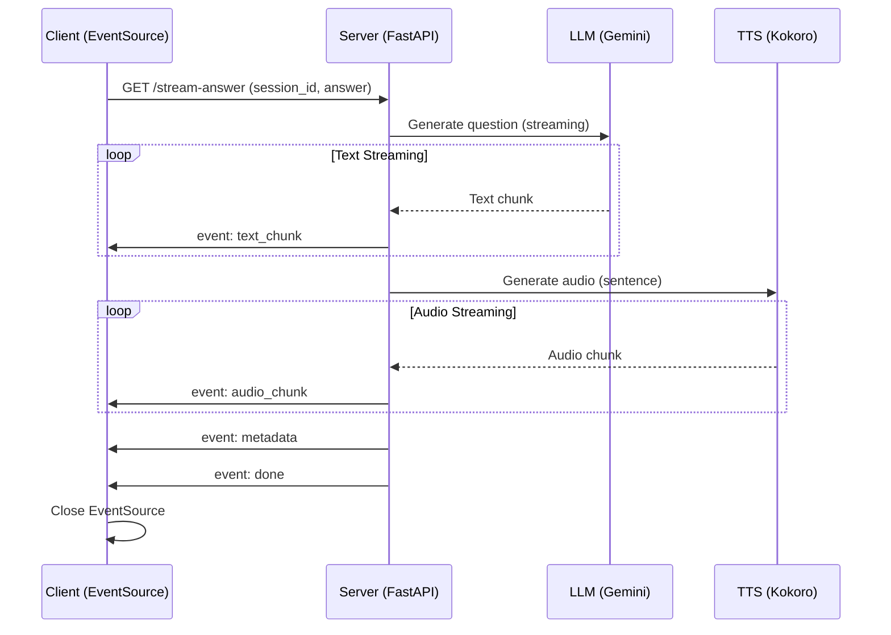
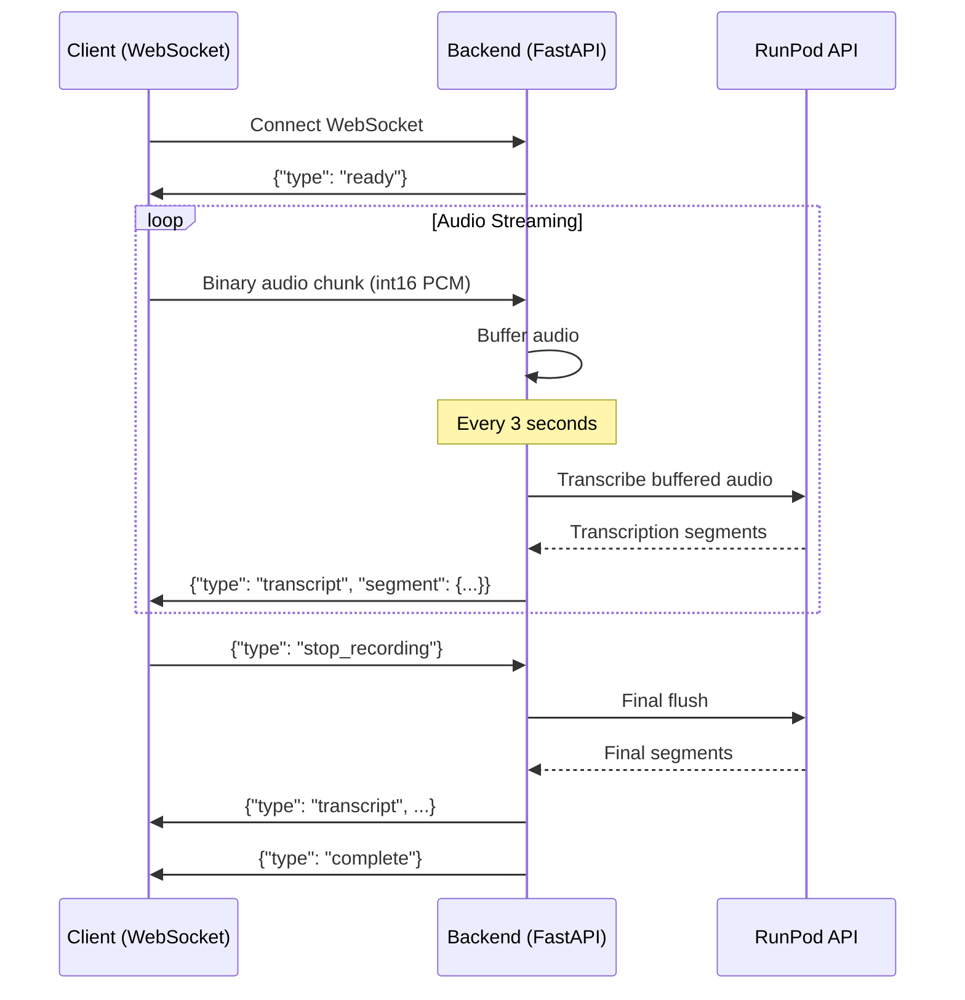

# xquizit System Architecture

## Overview

**xquizit** is a real-time AI-powered screening interview chatbot system that conducts automated technical interviews with live audio and text streaming capabilities. The system enables candidates to engage in natural conversation with an AI interviewer that evaluates their responses and adapts the interview flow dynamically.

### Core Capabilities

- **Intelligent Interview Orchestration**: LangGraph-based multiagent workflow that analyzes candidate documents and conducts strategic interviews
- **Real-Time Audio Transcription**: Serverless Whisper transcription via RunPod for low-latency speech-to-text
- **Streaming Text-to-Speech**: RealtimeTTS with Kokoro engine for natural conversational audio
- **Live Response Streaming**: Server-Sent Events (SSE) for real-time text and audio delivery
- **Adaptive Interview Logic**: Context-aware follow-up questions with intelligent topic rotation
- **Time-Constrained Interviews**: 45-minute limit with automatic conclusion generation

---

## Technology Stack

### Backend Stack
| Component | Technology | Purpose |
|-----------|------------|---------|
| **Web Framework** | FastAPI | Async HTTP server with REST, SSE, and WebSocket support |
| **Workflow Orchestration** | LangGraph | State machine implementation for interview logic |
| **LLM Integration** | LangChain + Google Gemini 2.5 Flash | Document analysis, question generation, answer evaluation |
| **Text-to-Speech** | RealtimeTTS + Kokoro | High-quality streaming audio synthesis |
| **Speech-to-Text** | RunPod Serverless + Whisper | Real-time audio transcription |
| **Document Processing** | PyPDF2 + python-docx | Resume and job description text extraction |
| **Audio Processing** | NumPy + SciPy | Audio format conversion and encoding |

### Frontend Stack
| Component | Technology | Purpose |
|-----------|------------|---------|
| **UI Framework** | React 18 + Vite | Modern component-based UI with fast builds |
| **HTTP Client** | Axios | REST API communication |
| **Streaming** | EventSource API | Server-Sent Events for real-time updates |
| **Real-Time Audio** | WebSocket API + Web Audio API | Bidirectional audio streaming and processing |
| **State Management** | React Hooks + Custom Hooks | Component state and audio playback queue |

### External Services
| Service | Provider | Purpose |
|---------|----------|---------|
| **LLM API** | Google Gemini 2.5 Flash | Natural language understanding and generation |
| **Transcription** | RunPod Serverless (Whisper) | Real-time speech recognition |
| **TTS Engine** | Kokoro (local) | Text-to-speech audio synthesis |

---

## High-Level Architecture

---

## System Architecture Layers

### 1. Presentation Layer (Frontend)

**Responsibilities:**
- User interface rendering and interaction
- Document upload (resume, job description)
- Real-time audio recording and playback
- Live transcription display
- Streaming message rendering with typing indicators

**Key Components:**
- **UploadScreen**: Document collection and interview initialization
- **ChatInterface**: Main interview UI with message history
- **AudioRecorder**: Microphone capture and WebSocket streaming
- **StreamingMessage**: Real-time text display with visual feedback
- **useAudioPlayback**: Audio queue management for seamless playback

### 2. Application Layer (Backend)

**Responsibilities:**
- HTTP/WebSocket/SSE endpoint management
- Session lifecycle management
- Interview orchestration and state management
- Audio/text streaming coordination
- External service integration

**Key Components:**
- **FastAPI Application**: HTTP server with CORS, exception handling
- **LangGraph Workflow**: State machine for interview logic
- **Session Manager**: In-memory session storage and retrieval
- **Document Processor**: PDF/DOCX text extraction
- **TTS Service**: Audio generation and streaming
- **RunPod Service**: Audio transcription coordination

### 3. Integration Layer

**Responsibilities:**
- LLM API communication (Gemini)
- Serverless transcription (RunPod)
- Audio synthesis (Kokoro TTS)
- Data format transformation

**Key Patterns:**
- **Adapter Pattern**: WebSocketAdapter for RunPod protocol translation
- **Singleton Pattern**: Shared TTS and RunPod service instances
- **Streaming Iterator**: Async generators for SSE and audio chunks

### 4. Data Layer

**Storage:**
- **In-Memory Sessions**: `sessions` dictionary (UUID → SessionData)
- **No Persistence**: Sessions lost on server restart
- **Suitable for**: Short-lived interview sessions (45 min max)

**State Management:**
- **LangGraph State**: TypedDict with message history reducer
- **Session State**: Pydantic models for type safety
- **Conversation History**: Accumulated in `messages` list

---

## Communication Patterns

### 1. REST API (HTTP)

**Purpose**: Document upload, interview initialization, status checks

**Pattern**: Request-Response (synchronous)

**Endpoints:**
- `POST /upload-documents` - Upload resume + job description + instructions
- `POST /start-interview` - Initialize session, receive first question
- `GET /interview-status/{session_id}` - Check interview progress

**Data Format**: JSON (application/json) and multipart/form-data

---

### 2. Server-Sent Events (SSE)

**Purpose**: Unidirectional streaming from server to client

**Pattern**: Long-lived HTTP connection with event stream

**Endpoint:**
- `GET /stream-answer` - Stream interview responses

**Event Types:**
- `text_chunk` - Incremental text segments (word-by-word)
- `audio_chunk` - Base64-encoded MP3 audio segments
- `metadata` - Interview metadata (question count, conclusion status)
- `done` - Stream completion signal

**Advantages:**
- Built-in reconnection (EventSource API)
- Named events for structured data
- Lower latency than polling
- HTTP/2 compatible

---

### 3. WebSocket (Bidirectional)

**Purpose**: Real-time audio streaming and transcription

**Pattern**: Persistent bidirectional connection

**Endpoint:**
- `GET /ws/transcribe/{session_id}` - Audio transcription WebSocket

**Message Flow:**
- **Client → Server**: Binary audio frames (int16 PCM, 16kHz, mono)
- **Server → Client**: JSON transcription messages

**Audio Chunk Size**: 4096 samples (~256ms at 16kHz)

**Control Messages:**
- `{"type": "stop_recording"}` - Signal recording completion
- `{"type": "ready"}` - Server ready to receive audio
- `{"type": "complete"}` - Transcription finalized

---

## Design Patterns

### 1. State Machine Pattern (LangGraph)

**Purpose**: Manage complex interview workflow with conditional routing

**Components:**
- **Nodes**: Discrete operations (analyze, generate, process, check, conclude)
- **Edges**: Transitions between nodes (conditional and deterministic)
- **State**: Shared context passed between nodes (InterviewState)
- **Reducers**: Message history accumulation with `add_messages`

**Benefits:**
- Declarative workflow definition
- Testable state transitions
- Clear separation of concerns
- Conditional logic without complex if/else chains

---

### 2. Singleton Pattern

**Purpose**: Share expensive resources across requests

**Implementation:**
- `TTS_SERVICE` global instance
- `RUNPOD_SERVICE` global instance
- Initialized at FastAPI startup
- Cleaned up at shutdown

**Benefits:**
- Resource efficiency (GPU memory, network connections)
- Consistent configuration
- Simplified dependency injection

---

### 3. Adapter Pattern

**Purpose**: Bridge incompatible interfaces

**Implementation:**
- `WebSocketAdapter` wraps FastAPI WebSocket
- Translates RunPod message format → Frontend format
- Handles async/sync boundary

**Benefits:**
- Decouples RunPod backend from FastAPI
- Allows protocol evolution without breaking changes
- Testable message transformation

---

### 4. Streaming Iterator Pattern

**Purpose**: Process data incrementally without buffering

**Implementation:**
- `_generate_question_stream()` - Async generator for LLM streaming
- `generate_stream()` (TTS) - Async generator for audio chunks
- SSE response uses async iteration

**Benefits:**
- Lower memory usage
- Reduced time-to-first-byte
- Better user experience (progressive rendering)

---

### 5. Custom Hooks Pattern (React)

**Purpose**: Encapsulate reusable stateful logic

**Implementation:**
- `useAudioPlayback` - Audio queue management
- Exposes clean API: `addAudioChunk()`, `stopPlayback()`, `reset()`

**Benefits:**
- Reusable across components
- Testable in isolation
- Separation of concerns (UI vs logic)

---

## Scalability Considerations

### Current Limitations (In-Memory State)

- **Sessions stored in memory**: Lost on restart
- **Single server**: No horizontal scaling
- **No load balancing**: Single point of failure

### Scaling Recommendations

1. **Persistent Storage**:
   - Move sessions to Redis or PostgreSQL
   - Enable server restarts without data loss
   - Support session recovery

2. **Horizontal Scaling**:
   - Deploy multiple backend instances
   - Use sticky sessions (session affinity) for WebSocket/SSE
   - Share session state via Redis

3. **WebSocket Scaling**:
   - Use Redis Pub/Sub for WebSocket message routing
   - Consider dedicated WebSocket servers

4. **Caching**:
   - Cache TTS audio for common phrases
   - Cache LLM responses for frequently asked questions

5. **Serverless Benefits** (Already Implemented):
   - RunPod auto-scales transcription workers
   - Gemini API handles LLM scaling
   - No local GPU required

---

## Security Considerations

### Current Implementation

- **CORS**: Allows all origins (`allow_origins=["*"]`)
- **No Authentication**: Sessions identified by UUID only
- **No Encryption**: Local development uses HTTP/WS (not HTTPS/WSS)

### Production Recommendations

1. **Authentication & Authorization**:
   - Implement JWT or session-based auth
   - Validate session ownership
   - Rate limiting per user

2. **CORS Hardening**:
   - Restrict origins to allowed domains
   - Validate Origin header

3. **Transport Security**:
   - Use HTTPS/WSS in production
   - SSL/TLS termination at reverse proxy

4. **Input Validation**:
   - Sanitize file uploads (size limits, content type validation)
   - Validate audio chunk sizes
   - SQL injection prevention (if database added)

5. **Secret Management**:
   - Store API keys in secrets manager (not .env files)
   - Rotate keys regularly
   - Use environment-specific keys

---

## Performance Optimization

### LLM Optimization (Implemented)

- **Thinking Budget**: Set to `0` for fastest responses (disabled extended thinking)
- **Max Output Tokens**: Limited to `1024` to prevent verbosity
- **Temperature**: `0.7` for balanced creativity
- **Impact**: 30-60% latency reduction, 600% cost reduction

### Audio Optimization

- **Sample Rate**: 16kHz (matches Whisper training data)
- **Chunk Size**: 4096 samples (~256ms) balances latency and overhead
- **Format**: int16 PCM (no encoding overhead)
- **TTS**: Direct synthesis mode bypasses playback layer

### Streaming Optimization

- **SSE**: Unidirectional streaming reduces overhead vs WebSocket for text
- **Audio Queue**: Prevents gaps between audio segments
- **Incremental Rendering**: Text displays as chunks arrive

### Network Optimization

- **RunPod Interval**: 3-second intervals balance latency and API cost
- **Audio Buffer**: Max 30 seconds prevents excessive memory usage
- **Connection Reuse**: Keep-alive connections to external APIs

---

## Monitoring & Observability

### Current Implementation

- **Timing Instrumentation**: `timing_utils` module tracks operation duration
- **Structured Logging**: Metadata (tokens, durations) logged per request
- **Performance Metrics**: Time-to-first-token, total duration, audio generation time

### Recommended Additions

1. **Application Metrics**:
   - Interview completion rate
   - Average interview duration
   - Question distribution
   - Follow-up question ratio

2. **System Metrics**:
   - Request latency (p50, p95, p99)
   - Error rates by endpoint
   - WebSocket connection count
   - SSE stream duration

3. **External Service Metrics**:
   - Gemini API latency and errors
   - RunPod transcription accuracy
   - TTS generation latency

4. **Business Metrics**:
   - Interviews started vs completed
   - Average questions per interview
   - Topic coverage analysis

---

## Future Architecture Enhancements

### Short-Term

1. **Persistent Sessions**: Redis-backed session storage
2. **Authentication**: JWT-based user authentication
3. **Metrics Dashboard**: Real-time monitoring UI
4. **Error Recovery**: Automatic session recovery on disconnect

### Medium-Term

1. **Multi-Tenancy**: Support multiple organizations
2. **Custom Interview Templates**: Configurable question sets
3. **Interview Analytics**: Post-interview reports and insights
4. **Video Support**: Add video streaming for face-to-face interviews

### Long-Term

1. **Microservices**: Split into transcription, TTS, interview services
2. **Event-Driven Architecture**: Kafka/RabbitMQ for async processing
3. **ML Pipeline**: Train custom models on interview data
4. **Global Distribution**: Multi-region deployment with CDN

---

## Conclusion

The xquizit architecture demonstrates a modern, real-time AI interview system with:

- **Modular design** separating concerns across layers
- **Real-time streaming** for responsive user experience
- **Serverless integrations** for scalability and cost efficiency
- **State machine orchestration** for complex workflow management
- **Performance optimization** through thinking budgets and streaming protocols

The current architecture supports development and small-scale deployment. For production scale, consider implementing persistent storage, authentication, horizontal scaling, and enhanced monitoring.
