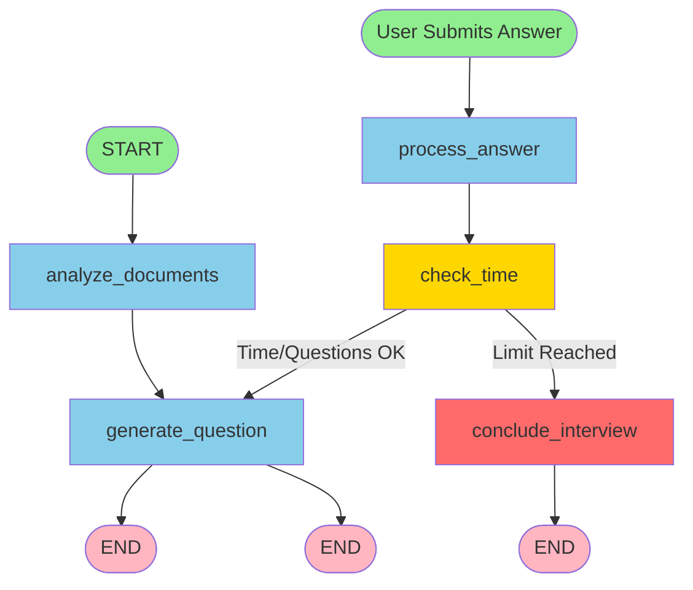

# Backend Module Documentation

## Overview

The xquizit backend is built on **FastAPI** and implements a sophisticated interview orchestration system using **LangGraph** for state machine management. The backend handles document processing, LLM interactions, real-time transcription, text-to-speech synthesis, and streaming responses to the frontend.

**Location**: `backend/`

**Key Technologies**:
- FastAPI (async web framework)
- LangGraph (state machine orchestration)
- LangChain (LLM integration framework)
- Google Gemini 2.5 Flash (LLM provider)
- RealtimeTTS + Kokoro (TTS engine)
- RunPod Serverless API (Whisper transcription)

---

## Module Architecture

```
backend/
├── main.py                          # FastAPI application entry point
├── interview_graph_v3.py            # LangGraph state machine (V3 architecture)
├── agents/                          # Specialized agent modules
├── prompts/                         # Prompt templates and schemas
├── models.py                        # Pydantic data models
├── document_processor.py            # PDF/DOCX text extraction
├── tts_service.py                   # Text-to-speech service
├── runpod_transcription_service.py  # Real-time transcription service
├── timing_utils.py                  # Performance instrumentation
├── requirements.txt                 # Python dependencies
└── .env.example                     # Environment configuration template
```
---

## Core Modules

### 1. main.py - FastAPI Application

**Purpose**: HTTP server entry point, endpoint definitions, service lifecycle management

#### Key Components

##### Settings Class

**Pydantic BaseSettings** for environment variable configuration:

```python
class Settings(BaseSettings):
    # Core API Keys
    gemini_api_key: str
    deepinfra_api_key: str = ""  # Legacy, optional

    # RunPod Transcription
    runpod_endpoint_id: str
    runpod_api_key: str
    runpod_max_buffer_seconds: int = 30

    # Whisper Configuration
    whisperlive_language: str = "en"
    whisperlive_model: str = "small"
    whisperlive_use_vad: bool = True
    whisperlive_no_speech_thresh: float = 0.45
    whisperlive_same_output_threshold: int = 7
    whisperlive_transcription_interval: float = 3.0

    # TTS Configuration
    tts_device: str = "auto"
    kokoro_voice: str = "af_bella"
    kokoro_speed: float = 1.0

    # LLM Performance Optimization
    gemini_thinking_budget: int = 0
    gemini_include_thoughts: bool = False
    gemini_max_output_tokens: int = 1024
    gemini_temperature: float = 0.7
```

**Configuration Sources**:
- Environment variables
- `.env` file (via `python-dotenv`)
- Default values

---

##### Global State

**In-Memory Session Storage**:
```python
sessions: Dict[str, SessionData] = {}
```

**Service Singletons**:
```python
interview_graph: Optional[StateGraph] = None
TTS_SERVICE: Optional[KokoroTTS] = None
RUNPOD_SERVICE: Optional[RunPodTranscriptionService] = None
```

**Lifecycle Management**:
- **Startup**: Initialize settings, services, LangGraph
- **Shutdown**: Cleanup sessions, close TTS/RunPod resources

---

#### API Endpoints

##### 1. POST /upload-documents

**Purpose**: Upload resume and job description documents

**Request**:
- Content-Type: `multipart/form-data`
- Fields:
  - `resume` (File): PDF or DOCX file
  - `job_description` (File): PDF or DOCX file
  - `custom_instructions` (Optional[str]): Additional guidance for interview

**Response**:
```json
{
  "session_id": "uuid-string",
  "message": "Documents uploaded successfully"
}
```

**Processing**:
1. Validate file formats (PDF, DOCX)
2. Extract text from documents using `document_processor`
3. Create new session with UUID
4. Store documents and instructions in session
5. Return session_id

**Error Handling**:
- Invalid file format → 400 Bad Request
- Document processing error → 500 Internal Server Error

---

##### 2. POST /start-interview

**Purpose**: Initialize interview session and generate first question

**Request**:
```json
{
  "session_id": "uuid-string"
}
```

**Response**:
```json
{
  "session_id": "uuid-string",
  "first_question": "Hello! I'm excited to learn about your background...",
  "audio_chunks": ["base64-encoded-mp3-chunk-1", "base64-encoded-mp3-chunk-2"],
  "start_time": "2025-11-04T10:30:00Z"
}
```

**Processing**:
1. Validate session exists
2. Run LangGraph workflow:
   - `analyze_documents` node
   - `generate_question` node (first question)
3. Generate TTS audio for first question
4. Store conversation history in session
5. Record interview start time
6. Return question + audio chunks

**Timing**:
- Document analysis: ~2-5 seconds (LLM call)
- Question generation: ~1-3 seconds (LLM call)
- TTS generation: ~1-2 seconds
- **Total**: ~4-10 seconds

---

##### 3. GET /stream-answer

**Purpose**: Submit candidate answer and stream interview response (SSE)

**Query Parameters**:
- `session_id` (str): Interview session identifier
- `answer` (str): Candidate's answer text

**Response**: Server-Sent Events stream

**Event Types**:

1. **text_chunk**:
   ```
   event: text_chunk
   data: {"text": "That's an interesting "}
   ```

2. **audio_chunk**:
   ```
   event: audio_chunk
   data: {"audio": "base64-encoded-mp3-data"}
   ```

3. **metadata**:
   ```
   event: metadata
   data: {
     "is_concluded": false,
     "questions_asked": 5,
     "time_elapsed": 300.5
   }
   ```

4. **done**:
   ```
   event: done
   data: {"status": "complete"}
   ```

**Processing Flow**:
1. Validate session and answer
2. Add answer to conversation history
3. Run LangGraph workflow:
   - `process_answer` → Evaluate answer, decide follow-up
   - `check_time` → Check time/question limits
   - `generate_question` (streaming) → Generate next question
4. **Streaming Text**: Yield text chunks as LLM generates
5. **Streaming Audio**: Generate TTS for complete sentences, yield audio chunks
6. Send metadata (question count, conclusion status)
7. Send `done` event

**Example Stream**:
```
event: text_chunk
data: {"text": "Thank you for "}

event: text_chunk
data: {"text": "that answer. "}

event: audio_chunk
data: {"audio": "UklGRiQ..."}

event: text_chunk
data: {"text": "Can you "}

event: text_chunk
data: {"text": "elaborate on "}

event: audio_chunk
data: {"audio": "UklGRiQ..."}

event: metadata
data: {"is_concluded": false, "questions_asked": 6}

event: done
data: {"status": "complete"}
```

---

##### 4. POST /submit-answer (Legacy)

**Purpose**: Non-streaming answer submission (backward compatibility)

**Request**:
```json
{
  "session_id": "uuid-string",
  "answer": "I have 5 years of experience with Python..."
}
```

**Response**:
```json
{
  "question": "Can you describe a challenging project?",
  "audio_chunks": ["base64-chunk-1", "base64-chunk-2"],
  "is_concluded": false,
  "questions_asked": 3,
  "time_elapsed": 180.5
}
```

**Note**: This endpoint is **deprecated**. Use `/stream-answer` for better UX.

---

##### 5. GET /ws/transcribe/{session_id}

**Purpose**: WebSocket endpoint for real-time audio transcription

**Protocol**: WebSocket (bidirectional)

**Connection Flow**:
1. Client connects: `ws://backend/ws/transcribe/{session_id}`
2. Server validates session
3. Server sends: `{"type": "ready"}`
4. Client starts sending audio chunks

**Message Types (Client → Server)**:

1. **Binary Audio Data**:
   - Format: int16 PCM, 16kHz, mono
   - Chunk size: 4096 samples (~256ms)
   - Encoding: Raw binary (ArrayBuffer)

2. **Control Messages (JSON)**:
   ```json
   {"type": "stop_recording"}
   ```

**Message Types (Server → Client)**:

1. **Ready**:
   ```json
   {"type": "ready"}
   ```

2. **Transcript Segment**:
   ```json
   {
     "type": "transcript",
     "segment": {
       "text": "Hello, I have experience",
       "is_final": false,
       "start": "0.0",
       "end": "2.5"
     }
   }
   ```

3. **Complete**:
   ```json
   {"type": "complete"}
   ```

**Processing**:
1. Accept WebSocket connection
2. Create `RunPodTranscriptionSession`
3. Buffer incoming audio chunks
4. Every 3 seconds (configurable):
   - Send buffered audio to RunPod API
   - Receive transcription segments
   - Forward segments to client
5. On `stop_recording`:
   - Trigger final flush
   - Send remaining segments
   - Send `complete` message

**Session Cleanup**:
- Automatic cleanup on disconnect
- Session removed from `RUNPOD_SERVICE`

---

##### 6. GET /interview-status/{session_id}

**Purpose**: Check interview progress

**Response**:
```json
{
  "session_id": "uuid-string",
  "questions_asked": 5,
  "is_concluded": false,
  "time_elapsed": 300.5,
  "start_time": "2025-11-04T10:30:00Z"
}
```

---

#### Exception Handling

**Custom Handlers**:
1. `DocumentProcessingError` → 500 Internal Server Error
2. Generic exceptions → 500 with error message
3. HTTP exceptions → Passed through

**Error Response Format**:
```json
{
  "detail": "Error message here"
}
```

---

#### CORS Configuration

**Current**:
```python
allow_origins=["*"]  # Testing mode
allow_credentials=True
allow_methods=["*"]
allow_headers=["*"]
```

**Production Recommendation**:
```python
allow_origins=["https://your-domain.com"]
```

---

### 2. interview_graph_v3.py - LangGraph State Machine (V3 Architecture)

**Purpose**: Implement interview workflow using Hybrid Modular State Machine architecture

#### InterviewGraphBuilderV3 Class

**Initialization**:
```python
builder = InterviewGraphBuilderV3(
    gemini_api_key=settings.gemini_api_key,
    model_name=settings.gemini_model,
    thinking_budget=settings.gemini_thinking_budget,
    include_thoughts=settings.gemini_include_thoughts,
    max_output_tokens=settings.gemini_max_output_tokens,
    temperature=settings.gemini_temperature
)
graph = builder.build()
```

---

#### LLM Configuration

**Two LLM Instances** for different use cases:

1. **llm_analysis** (Document Analysis):
   ```python
   ChatGoogleGenerativeAI(
       model="gemini-2.5-flash",
       temperature=0.7,
       # No thinking budget constraints
       # No max_output_tokens constraints
   )
   ```

2. **llm_realtime** (Real-Time Operations):
   ```python
   ChatGoogleGenerativeAI(
       model="gemini-2.5-flash",
       temperature=0.7,
       thinking={
           "type": "enabled" if thinking_budget > 0 else "disabled",
           "budget_tokens": thinking_budget
       },
       max_output_tokens=max_output_tokens,
       include_thoughts=include_thoughts
   )
   ```

**Performance Impact**:
- Thinking budget = 0: **30-60% faster** responses
- Max output tokens = 1024: **Prevents verbosity**, faster completion
- **Cost reduction**: Up to 600% savings (thinking tokens are expensive)

---

#### State Machine Graph



---

#### State Machine Nodes

##### 1. analyze_documents

**Purpose**: Analyze resume and job description to create interview strategy

**Input State**:
```python
{
    "resume_text": "John Doe...",
    "job_description_text": "Senior Python Developer...",
    "custom_instructions": "Focus on leadership experience"
}
```

**Processing**:
1. Build prompt with documents and custom instructions
2. Call `llm_analysis` (no speed constraints)
3. Parse response to extract:
   - Interview strategy
   - Key topics to cover
   - Skill focus areas

**Output State**:
```python
{
    "interview_strategy": "Focus on Python, leadership, architecture...",
    "key_topics": ["Python Experience", "Team Leadership", "System Design"]
}
```

**LLM Prompt Template**:
```
You are an AI interview assistant analyzing candidate documents.

Resume:
{resume_text}

Job Description:
{job_description_text}

Custom Instructions:
{custom_instructions}

Create an interview strategy covering:
1. Key topics from resume matching job requirements
2. Skills to evaluate
3. Areas requiring follow-up

Output format:
STRATEGY:
<strategy description>

TOPICS:
- Topic 1
- Topic 2
- Topic 3
```

**Timing**: ~2-5 seconds (one-time per interview)

---

##### 2. generate_question

**Purpose**: Generate next interview question (synchronous version)

**Input State**:
```python
{
    "messages": [...conversation history...],
    "interview_strategy": "...",
    "key_topics": [...],
    "current_topic_index": 2,
    "questions_asked": 5,
    "topic_followup_counts": {"Python Experience": 1}
}
```

**Processing**:
1. Determine if this is first question (introductory)
2. Select topic based on rotation strategy
3. Build prompt with:
   - Interview strategy
   - Current topic
   - Conversation history (last 6 messages for context)
   - Question count guidance
4. Call `llm_realtime` (optimized for speed)
5. Clean response (remove artifacts, formatting)

**Output State**:
```python
{
    "messages": [...updated with new question...]
}
```

**Question Rotation Strategy**:
- **First question**: Always introductory/welcoming
- **Subsequent questions**: Cycle through `key_topics`
- **Topic selection**: `current_topic_index % len(key_topics)`
- **Follow-up logic**: Determined by `process_answer` node

**LLM Prompt Template**:
```
You are conducting a technical interview.

Interview Strategy:
{interview_strategy}

Current Topic Focus:
{current_topic}

Recent Conversation:
{last_6_messages}

Question #{questions_asked + 1}:
Generate a focused question about {current_topic}.
Keep it concise and relevant to the job requirements.
```

**Timing**: ~1-3 seconds per question

---

##### 3. generate_question_stream (Async)

**Purpose**: Stream question generation for real-time SSE responses

**Differences from sync version**:
- Uses `astream()` instead of `invoke()`
- Yields chunks as they arrive
- Used by `/stream-answer` endpoint

**Processing**:
```python
async for chunk in llm_realtime.astream(prompt):
    if chunk.content:
        yield chunk.content
```

**Benefits**:
- Lower time-to-first-token
- Progressive rendering in UI
- Better perceived performance

---

##### 4. process_answer

**Purpose**: Evaluate candidate answer and decide follow-up strategy

**Input State**:
```python
{
    "messages": [...conversation history...],
    "current_topic_index": 2,
    "topic_followup_counts": {"Python Experience": 1},
    "last_question_topic": "Python Experience"
}
```

**Processing**:
1. Build prompt with:
   - Last question asked
   - Candidate's answer
   - Current topic
2. Call `llm_realtime` to evaluate answer
3. Parse decision: "follow_up" or "next_topic"
4. Update follow-up counters
5. Enforce limits (max 2 follow-ups per topic)

**Output State**:
```python
{
    "needs_followup": True,
    "topic_followup_counts": {"Python Experience": 2},
    "current_topic_index": 2  # unchanged if follow-up
}
```

**Follow-Up Logic**:
```python
if needs_followup and followup_count < 2:
    # Stay on same topic, ask follow-up
    pass
else:
    # Move to next topic
    current_topic_index += 1
```

**LLM Prompt Template**:
```
You are evaluating a candidate's answer.

Question Asked:
{last_question}

Candidate's Answer:
{answer}

Topic:
{current_topic}

Evaluate:
1. Does the answer adequately address the question?
2. Are there gaps requiring follow-up?
3. Should we ask a follow-up or move to next topic?

Respond with:
DECISION: follow_up OR next_topic
REASON: <brief explanation>
```

**Timing**: ~1-2 seconds

---

##### 5. check_time

**Purpose**: Monitor time and question limits

**Input State**:
```python
{
    "start_time": "2025-11-04T10:30:00Z",
    "questions_asked": 14
}
```

**Processing**:
1. Calculate elapsed time: `now - start_time`
2. Check limits:
   - Time: 45 minutes (2700 seconds)
   - Questions: 16 maximum
3. Decide routing:
   - Limits OK → `generate_question`
   - Limits exceeded → `conclude_interview`

**Output State**:
```python
{
    "should_conclude": True  # if limits exceeded
}
```

**Conditional Edge**:
```python
if state["should_conclude"] or questions_asked >= 16:
    return "conclude_interview"
else:
    return "generate_question"
```

---

##### 6. conclude_interview

**Purpose**: Generate conclusion message

**Input State**:
```python
{
    "messages": [...conversation history...],
    "questions_asked": 16,
    "start_time": "..."
}
```

**Processing**:
1. Build prompt with conversation summary
2. Call `llm_realtime` to generate conclusion
3. Mark interview as concluded

**Output State**:
```python
{
    "messages": [...updated with conclusion...],
    "is_concluded": True
}
```

**LLM Prompt Template**:
```
The interview has concluded. Generate a warm, professional closing message.

Interview Summary:
- Questions asked: {questions_asked}
- Duration: {duration}

Generate a message thanking the candidate and explaining next steps.
```

---

#### Helper Methods

##### _extract_topics()

**Purpose**: Parse interview strategy to extract key topics

**Input**: `"TOPICS:\n- Python\n- Leadership\n- System Design"`

**Output**: `["Python", "Leadership", "System Design"]`

**Logic**:
1. Find "TOPICS:" section
2. Split by newlines
3. Extract lines starting with "-" or "•"
4. Clean whitespace

---

##### _clean_question_response()

**Purpose**: Remove LLM artifacts from generated questions

**Removes**:
- "QUESTION:" prefix
- "Question #N:" patterns
- Markdown formatting
- Extra whitespace

**Example**:
- Input: `"QUESTION: Can you describe your experience?"`
- Output: `"Can you describe your experience?"`

---

##### _prepare_question_generation()

**Purpose**: Shared logic for sync and async question generation

**Returns**: Prepared prompt for LLM

---

#### Configuration Constants

```python
MAX_INTERVIEW_TIME_SECONDS = 2700  # 45 minutes
MAX_QUESTIONS = 16
MAX_FOLLOWUPS_PER_TOPIC = 2
CONTEXT_MESSAGE_LIMIT = 6  # Last 6 messages for context
```

---

### 3. models.py - Data Models

**Purpose**: Pydantic models for type safety and API contracts

#### State Models

##### InterviewState (TypedDict)

**LangGraph state schema**:

```python
class InterviewState(TypedDict):
    # Documents
    resume_text: str
    job_description_text: str
    custom_instructions: str

    # Interview Strategy
    interview_strategy: str
    key_topics: List[str]

    # Conversation
    messages: Annotated[List, add_messages]  # Message history with reducer

    # State Tracking
    questions_asked: int
    current_topic_index: int
    topic_followup_counts: Dict[str, int]
    last_question_topic: str

    # Interview Control
    start_time: str
    should_conclude: bool
    is_concluded: bool
    needs_followup: bool
```

**Key Features**:
- `add_messages` reducer: Automatically accumulates messages
- Type hints for IDE support
- Shared state across all nodes

---

##### SessionData (BaseModel)

**Session storage model**:

```python
class SessionData(BaseModel):
    session_id: str
    resume_text: str
    job_description_text: str
    custom_instructions: str = ""
    interview_state: Dict[str, Any]
    start_time: Optional[datetime] = None
    last_activity: datetime
```

**Usage**:
```python
sessions[session_id] = SessionData(
    session_id=session_id,
    resume_text=resume,
    job_description_text=jd,
    interview_state={},
    last_activity=datetime.now()
)
```

---

#### API Request/Response Models

##### UploadDocumentsRequest

```python
class UploadDocumentsRequest(BaseModel):
    resume: UploadFile
    job_description: UploadFile
    custom_instructions: Optional[str] = ""
```

##### UploadDocumentsResponse

```python
class UploadDocumentsResponse(BaseModel):
    session_id: str
    message: str
```

##### StartInterviewRequest

```python
class StartInterviewRequest(BaseModel):
    session_id: str
```

##### StartInterviewResponse

```python
class StartInterviewResponse(BaseModel):
    session_id: str
    first_question: str
    audio_chunks: List[str]  # Base64-encoded MP3
    start_time: str
```

##### SubmitAnswerRequest

```python
class SubmitAnswerRequest(BaseModel):
    session_id: str
    answer: str
```

##### SubmitAnswerResponse

```python
class SubmitAnswerResponse(BaseModel):
    question: str
    audio_chunks: List[str]
    is_concluded: bool
    questions_asked: int
    time_elapsed: float
```

##### InterviewStatusResponse

```python
class InterviewStatusResponse(BaseModel):
    session_id: str
    questions_asked: int
    is_concluded: bool
    time_elapsed: float
    start_time: Optional[str]
```

##### ErrorResponse

```python
class ErrorResponse(BaseModel):
    detail: str
```

---

#### Transcription Models

##### TranscriptionSegment

```python
class TranscriptionSegment(BaseModel):
    text: str
    start: float
    end: float
    is_final: bool
```

##### TranscriptionMessage

```python
class TranscriptionMessage(BaseModel):
    type: str  # "transcript", "ready", "complete"
    segment: Optional[TranscriptionSegment]
```

---

### 4. document_processor.py - Document Text Extraction

**Purpose**: Extract text from PDF and DOCX files

#### Functions

##### extract_text_from_pdf()

**Signature**:
```python
def extract_text_from_pdf(file_path: str) -> str
```

**Processing**:
1. Open PDF with `PyPDF2.PdfReader`
2. Iterate through pages
3. Extract text from each page
4. Concatenate with newlines

**Example**:
```python
text = extract_text_from_pdf("resume.pdf")
# Returns: "John Doe\nSoftware Engineer\n..."
```

**Error Handling**:
- File not found → `DocumentProcessingError`
- Corrupted PDF → `DocumentProcessingError`

---

##### extract_text_from_docx()

**Signature**:
```python
def extract_text_from_docx(file_path: str) -> str
```

**Processing**:
1. Open DOCX with `python-docx.Document`
2. Extract text from:
   - Paragraphs (`doc.paragraphs`)
   - Tables (`doc.tables`)
3. Concatenate with newlines

**Example**:
```python
text = extract_text_from_docx("resume.docx")
# Returns: "John Doe\nSoftware Engineer\n..."
```

---

##### extract_text_from_document()

**Signature**:
```python
def extract_text_from_document(file_path: str) -> str
```

**Processing**:
1. Detect file extension
2. Route to appropriate extractor:
   - `.pdf` → `extract_text_from_pdf()`
   - `.docx`, `.doc` → `extract_text_from_docx()`
3. Validate non-empty content

**Error Handling**:
- Unsupported format → `DocumentProcessingError`
- Empty document → `DocumentProcessingError`

**Example**:
```python
try:
    text = extract_text_from_document("resume.pdf")
except DocumentProcessingError as e:
    print(f"Error: {e}")
```

---

#### Custom Exceptions

```python
class DocumentProcessingError(Exception):
    """Raised when document processing fails"""
    pass
```

---

### 5. tts_service.py - Text-to-Speech Service

**Purpose**: Real-time TTS using RealtimeTTS with Kokoro engine

#### KokoroTTS Class

##### Initialization

**Parameters**:
- `device` (str): "auto", "cuda", or "cpu"
- `voice` (str): "af_bella", "af_sarah", "am_adam", "am_michael"
- `speed` (float): Speech speed multiplier (default: 1.0)

**Processing**:
1. Auto-detect CUDA availability
2. Initialize KokoroEngine
3. Create TextToAudioStream (direct synthesis mode)

**Example**:
```python
tts = KokoroTTS(
    device="auto",
    voice="af_bella",
    speed=1.0
)
```

---

##### generate_stream() (Async)

**Signature**:
```python
async def generate_stream(self, text: str) -> AsyncGenerator[str, None]
```

**Purpose**: Generate streaming audio chunks for real-time playback

**Processing**:
1. Feed text to TTS engine
2. Iterate through audio chunks as they're synthesized
3. Convert numpy array → WAV bytes
4. Base64 encode
5. Yield chunk

**Example**:
```python
async for audio_chunk in tts.generate_stream("Hello, world!"):
    # audio_chunk is base64-encoded MP3
    send_to_client(audio_chunk)
```

**Chunk Size**: Variable (1-2 seconds of audio per chunk)

**Format**: 24kHz, 16-bit, mono WAV (base64-encoded)

---

##### _audio_to_bytes()

**Signature**:
```python
def _audio_to_bytes(self, audio_array: np.ndarray) -> str
```

**Processing**:
1. Normalize audio to int16 range
2. Convert to int16 numpy array
3. Create WAV file in memory (BytesIO)
4. Base64 encode
5. Return as string

**Format**:
```python
scipy.io.wavfile.write(
    buffer,
    rate=24000,
    data=audio_int16
)
```

---

##### cleanup()

**Purpose**: Release resources and clear GPU cache

**Processing**:
1. Close TextToAudioStream
2. Clear CUDA cache (if applicable)
3. Delete engine reference

**Example**:
```python
tts.cleanup()
```

---

#### Global Service Access

```python
TTS_SERVICE: Optional[KokoroTTS] = None

def get_tts_service() -> KokoroTTS:
    if TTS_SERVICE is None:
        raise RuntimeError("TTS service not initialized")
    return TTS_SERVICE
```

**Usage**:
```python
tts = get_tts_service()
async for chunk in tts.generate_stream(text):
    ...
```

---

### 6. runpod_transcription_service.py - Real-Time Transcription

**Purpose**: RunPod serverless Whisper transcription integration

#### Architecture

**Three-Layer Design**:
1. **WebSocketAdapter**: Protocol translation layer
2. **RunPodTranscriptionSession**: Per-user session management
3. **RunPodTranscriptionService**: Singleton service manager

---

#### WebSocketAdapter Class

**Purpose**: Bridge FastAPI WebSocket and RunPod protocol

##### Initialization

```python
adapter = WebSocketAdapter(
    websocket=fastapi_websocket,
    session_id=session_id
)
```

##### Key Methods

**send_message()**:
```python
async def send_message(self, message_type: str, data: Dict):
    await self.websocket.send_json({
        "type": message_type,
        "data": data
    })
```

**transform_runpod_to_frontend()**:

**Purpose**: Convert RunPod message format → Frontend format

**Input (RunPod)**:
```json
{
  "segments": [{
    "text": "Hello world",
    "start": 0.0,
    "end": 1.5
  }]
}
```

**Output (Frontend)**:
```json
{
  "type": "transcript",
  "segment": {
    "text": "Hello world",
    "is_final": true,
    "start": "0.0",
    "end": "1.5"
  }
}
```

**Timestamp Conversion**: `float → string` for JSON serialization

---

#### RunPodTranscriptionSession Class

**Purpose**: Manage transcription for single user session

##### Initialization

```python
session = RunPodTranscriptionSession(
    session_id=session_id,
    websocket_adapter=adapter,
    runpod_endpoint_id=endpoint_id,
    runpod_api_key=api_key,
    config=config
)
```

##### Audio Buffer Management

**Buffer**:
```python
self.audio_buffer = []  # List of int16 numpy arrays
```

**add_audio_chunk()**:
```python
def add_audio_chunk(self, audio_data: bytes):
    # Convert bytes → int16 numpy array
    audio_array = np.frombuffer(audio_data, dtype=np.int16)
    self.audio_buffer.append(audio_array)

    # Trim buffer if exceeds max_buffer_seconds
    if len(self.audio_buffer) > max_chunks:
        self.audio_buffer = self.audio_buffer[-max_chunks:]
```

---

##### RunPod API Communication

**transcribe_audio()**:

**Purpose**: Send buffered audio to RunPod API

**Processing**:
1. Concatenate audio buffer
2. Convert int16 → float32 normalized [-1, 1]
3. Encode as WAV file (scipy)
4. Base64 encode
5. Send POST request to RunPod endpoint
6. Parse transcription segments
7. Forward to WebSocket adapter

**Request Format**:
```json
{
  "input": {
    "audio": "base64-encoded-wav-data",
    "model": "small",
    "language": "en",
    "use_vad": true,
    "no_speech_threshold": 0.45
  }
}
```

**Response Format**:
```json
{
  "output": {
    "segments": [
      {"text": "...", "start": 0.0, "end": 1.5}
    ]
  }
}
```

**Error Handling**:
- Network errors → Log and retry
- API errors → Log and continue
- Malformed response → Skip segment

---

##### Periodic Transcription

**Background Task**:
```python
asyncio.create_task(self._periodic_transcription())
```

**Logic**:
```python
async def _periodic_transcription(self):
    while self.is_active:
        await asyncio.sleep(self.transcription_interval)  # 3 seconds

        if len(self.audio_buffer) > 0:
            await self.transcribe_audio()
```

**Configurable Interval**: Default 3 seconds (balances latency and API cost)

---

##### Final Flush

**stop_recording()**:

**Purpose**: Process remaining audio and finalize transcription

**Processing**:
1. Stop periodic task
2. Transcribe remaining buffered audio
3. Send all final segments
4. Send "complete" message

**Example**:
```python
await session.stop_recording()
# → Sends final transcripts + "complete" message
```

---

#### RunPodTranscriptionService Class

**Purpose**: Singleton service managing all sessions

##### Initialization

```python
service = RunPodTranscriptionService(
    endpoint_id=settings.runpod_endpoint_id,
    api_key=settings.runpod_api_key,
    model=settings.whisperlive_model,
    language=settings.whisperlive_language,
    use_vad=settings.whisperlive_use_vad,
    transcription_interval=settings.whisperlive_transcription_interval,
    max_buffer_seconds=settings.runpod_max_buffer_seconds
)
```

##### Session Management

**create_session()**:
```python
async def create_session(
    self,
    session_id: str,
    websocket: WebSocket
) -> RunPodTranscriptionSession:
    adapter = WebSocketAdapter(websocket, session_id)
    session = RunPodTranscriptionSession(...)
    self.sessions[session_id] = session
    return session
```

**remove_session()**:
```python
async def remove_session(self, session_id: str):
    if session_id in self.sessions:
        await self.sessions[session_id].stop_recording()
        del self.sessions[session_id]
```

**cleanup()**:
```python
async def cleanup(self):
    for session_id in list(self.sessions.keys()):
        await self.remove_session(session_id)
```

---

#### Configuration

```python
class RunPodConfig:
    model: str = "small"  # Whisper model size
    language: str = "en"
    use_vad: bool = True
    no_speech_threshold: float = 0.45
    same_output_threshold: int = 7
    transcription_interval: float = 3.0
    max_buffer_seconds: int = 30
```

---

### 7. timing_utils.py - Performance Instrumentation

**Purpose**: Measure and log operation timing

#### time_operation() Context Manager

**Usage**:
```python
with time_operation("LLM Call") as timing:
    result = llm.invoke(prompt)
    timing.metadata["tokens"] = len(result)
```

**Output**:
```
[TIMING] LLM Call: 2.34s (tokens: 1024)
```

---

#### @timed() Decorator

**Usage**:
```python
@timed("Database Query")
def fetch_data():
    ...
```

**Output**:
```
[TIMING] Database Query: 0.45s
```

---

#### TimingSummary Class

**Purpose**: Accumulate timing data per request

**Usage**:
```python
summary = TimingSummary()

with time_operation("Step 1") as t1:
    ...
    summary.add(t1)

with time_operation("Step 2") as t2:
    ...
    summary.add(t2)

print(summary.report())
```

**Output**:
```
Timing Summary:
  Step 1: 2.34s (tokens: 1024)
  Step 2: 1.56s
  Total: 3.90s
```

---

## Environment Configuration

### Required Variables

```env
# Google Gemini API
GEMINI_API_KEY=your_gemini_api_key_here

# RunPod Transcription
RUNPOD_ENDPOINT_ID=your-endpoint-id-here
RUNPOD_API_KEY=your-api-key-here
```

### Optional Variables

```env
# Transcription Settings
WHISPERLIVE_LANGUAGE=en
WHISPERLIVE_MODEL=small
WHISPERLIVE_USE_VAD=true
WHISPERLIVE_NO_SPEECH_THRESH=0.45
WHISPERLIVE_SAME_OUTPUT_THRESHOLD=7
WHISPERLIVE_TRANSCRIPTION_INTERVAL=3.0
RUNPOD_MAX_BUFFER_SECONDS=30

# TTS Configuration
TTS_DEVICE=auto
KOKORO_VOICE=af_bella
KOKORO_SPEED=1.0

# LLM Performance Optimization
GEMINI_THINKING_BUDGET=0
GEMINI_INCLUDE_THOUGHTS=false
GEMINI_MAX_OUTPUT_TOKENS=1024
GEMINI_TEMPERATURE=0.7
```

---

## Deployment Considerations

### Development

```bash
cd backend
uvicorn main:app --reload --host 0.0.0.0 --port 8000
```

### Production

**Recommendations**:
1. Use production ASGI server (Gunicorn + Uvicorn workers)
2. Enable persistent storage (Redis/PostgreSQL)
3. Implement authentication
4. Configure CORS for specific domains
5. Add rate limiting
6. Use HTTPS/WSS

**Example**:
```bash
gunicorn main:app \
  --workers 4 \
  --worker-class uvicorn.workers.UvicornWorker \
  --bind 0.0.0.0:8000 \
  --access-logfile - \
  --error-logfile -
```

---

## Performance Metrics

### Typical Latencies

| Operation | Latency | Notes |
|-----------|---------|-------|
| Document Analysis | 2-5s | One-time per interview |
| Question Generation (optimized) | 1-3s | Per question |
| Answer Evaluation | 1-2s | Per answer |
| TTS Generation | 1-2s | Per question |
| Transcription (RunPod) | 1-3s | Per 3-second interval |
| **Total Round-Trip** | **5-10s** | Stop recording → next question |

### Optimization Impact

- **Thinking Budget = 0**: 30-60% faster
- **Max Output Tokens = 1024**: Prevents verbosity delays
- **Cost Reduction**: Up to 600% savings

---

## Summary

The backend is architected for:

- **Real-time performance** through optimized LLM configuration and streaming protocols
- **Modular design** with clear separation of concerns
- **Scalability** via serverless integrations (RunPod, Gemini)
- **Type safety** using Pydantic models throughout
- **Observability** with comprehensive timing instrumentation

Key strengths include the LangGraph state machine for complex workflow orchestration, streaming support for low-latency user experience, and performance optimization through thinking budgets and token limits.
