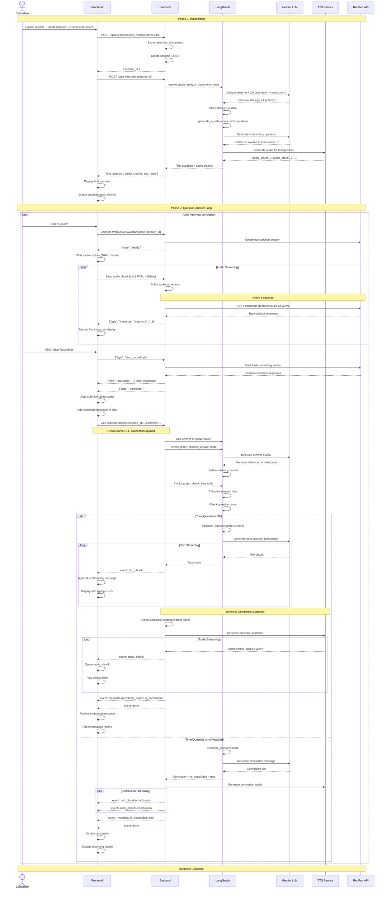
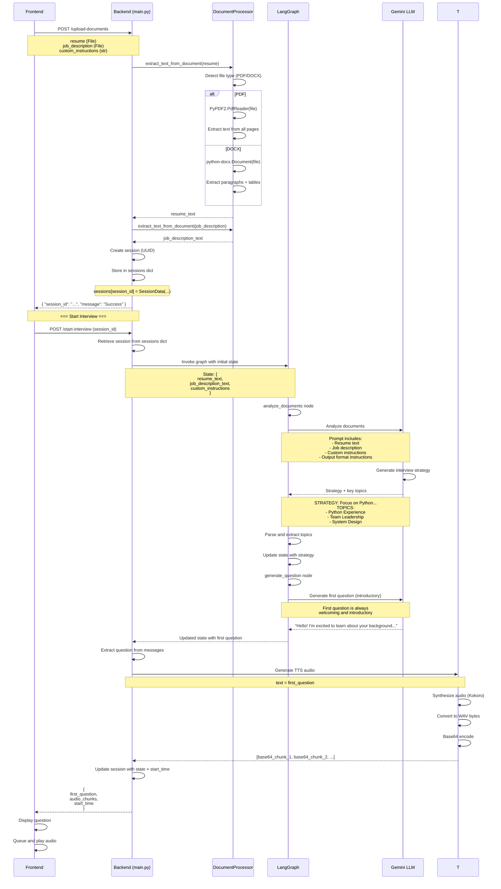
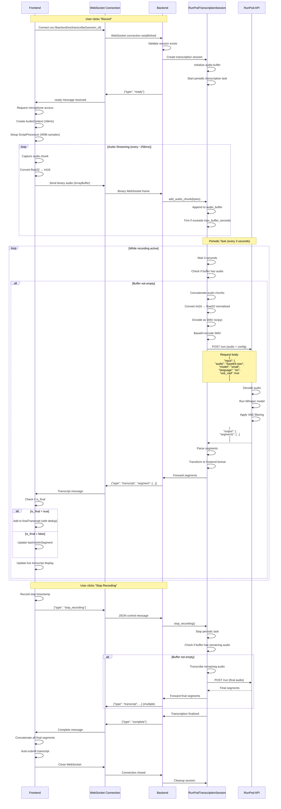
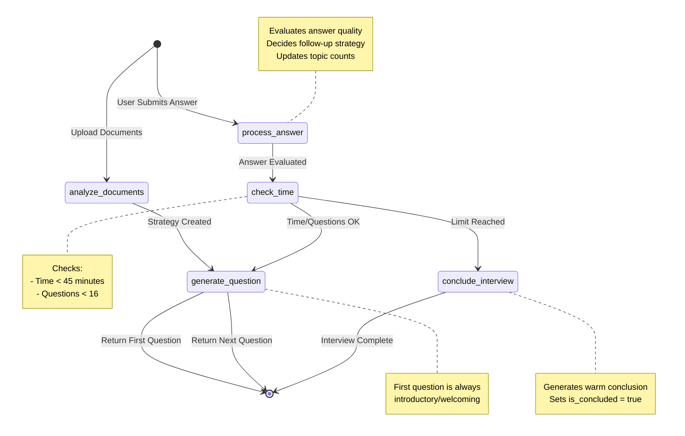
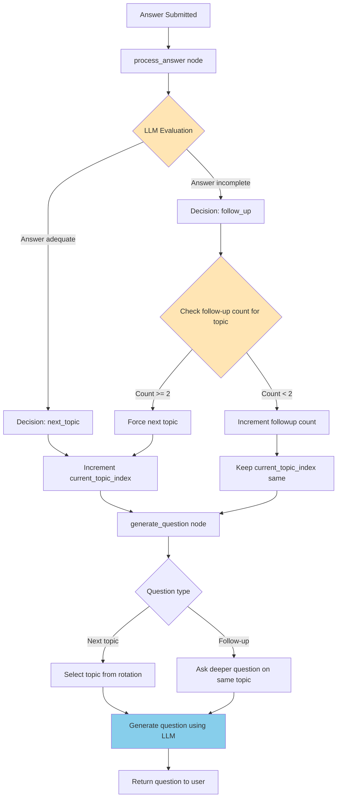
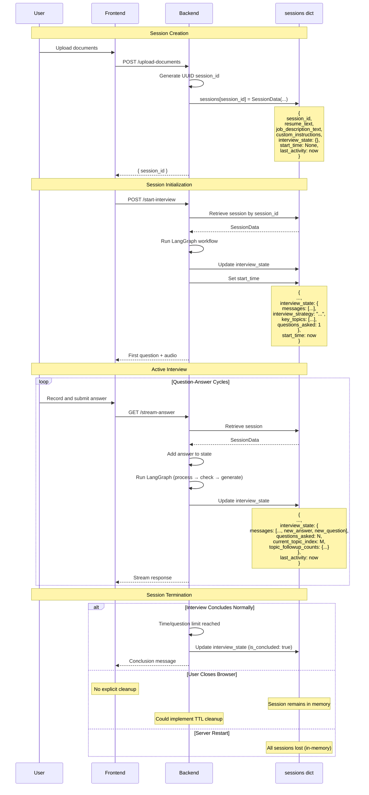
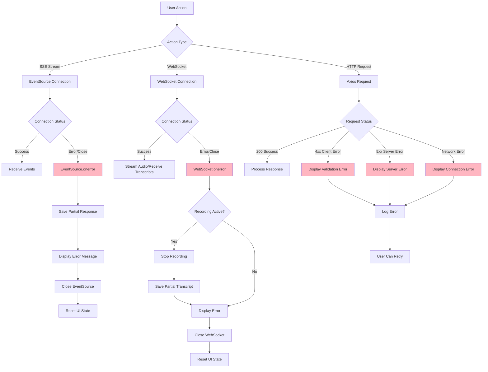

# Interview Flow & Data Flow Documentation

## Overview

This document details the complete data flow and workflow sequences for the xquizit interview system, including document processing, real-time transcription, streaming responses, and interview orchestration.

---

## Complete Interview Workflow



---

## Detailed Flow Breakdowns

### 1. Document Upload and Analysis Flow



**Key Points**:
- Document analysis happens **once** per interview
- Strategy guides all subsequent questions
- Key topics extracted for rotation logic
- First question always introductory

---

### 2. Real-Time Transcription Flow (RunPod WebSocket)



**Key Points**:
- **Buffering**: Audio buffered in backend, sent to RunPod every 3 seconds
- **Deduplication**: Frontend uses timestamps to prevent duplicate segments
- **Final Flush**: Remaining audio processed on stop_recording
- **Auto-Submit**: Frontend automatically submits when complete message received

**Performance**:
- **Latency**: 1-3 seconds per transcription cycle
- **Accuracy**: Improved with VAD (Voice Activity Detection)
- **Cost**: ~$0.50-$1.00 per 30-minute interview

---

### 3. Streaming Response Flow (SSE)

```mermaid
sequenceDiagram
    participant F as Frontend
    participant E as EventSource
    participant B as Backend
    participant G as LangGraph
    participant L as Gemini LLM
    participant T as TTS Service

    Note over F,B: User submitted answer via transcription

    F->>E: Create EventSource
    Note over F,E: GET /stream-answer?<br/>session_id=...&<br/>answer=...

    E->>B: HTTP GET (SSE connection)
    B->>B: Retrieve session
    B->>B: Add answer to conversation

    B->>G: Invoke graph: process_answer
    G->>L: Evaluate answer
    Note over G,L: Prompt:<br/>- Last question<br/>- Candidate answer<br/>- Current topic<br/><br/>Return:<br/>DECISION: follow_up | next_topic

    L-->>G: Decision + reasoning
    G->>G: Update needs_followup
    G->>G: Update topic_followup_counts

    alt Follow-up needed and count < 2
        G->>G: Keep current_topic_index same
    else Move to next topic
        G->>G: Increment current_topic_index
    end

    G->>G: Transition to check_time node
    G->>G: Calculate time elapsed
    G->>G: Check questions_asked count

    alt Time OK and questions < 16
        G->>G: Transition to generate_question
        G->>L: Generate question (streaming)
        Note over G,L: Stream mode:<br/>astream() instead of invoke()

        loop Text Streaming
            L-->>G: Chunk of text
            G-->>B: Chunk
            B->>B: Accumulate in text buffer
            B->>E: event: text_chunk\ndata: {"text": "..."}
            E->>F: text_chunk event
            F->>F: Append to streamingMessage.text
            F->>F: Render with typing cursor

            Note over B: Sentence Detection
            B->>B: Check if buffer has complete sentence
            alt Complete sentence found
                B->>B: Extract sentence
                B->>T: generate_stream(sentence)

                loop Audio Chunks
                    T-->>B: Base64 audio chunk
                    B->>E: event: audio_chunk\ndata: {"audio": "..."}
                    E->>F: audio_chunk event
                    F->>F: addAudioChunk(base64)
                    F->>F: Queue for playback
                end

                B->>B: Clear sentence from buffer
            end
        end

        G-->>B: Stream complete

        B->>B: Generate audio for remaining text
        B->>T: generate_stream(remaining_text)
        T-->>B: Final audio chunks
        B->>E: event: audio_chunk (final chunks)

        B->>B: Prepare metadata
        B->>E: event: metadata\ndata: {<br/>  "is_concluded": false,<br/>  "questions_asked": N<br/>}
        E->>F: metadata event
        F->>F: Update question counter

        B->>E: event: done\ndata: {"status": "complete"}
        E->>F: done event

        F->>F: Finalize streamingMessage
        F->>F: Add to messages array
        F->>F: Clear streamingMessage
        F->>E: Close EventSource

    else Time limit or max questions reached
        G->>G: Transition to conclude_interview
        G->>L: Generate conclusion message
        L-->>G: Conclusion text
        G-->>B: Conclusion + is_concluded = true

        B->>E: event: text_chunk (conclusion text)
        E->>F: Display conclusion with typing effect

        B->>T: generate_stream(conclusion)
        T-->>B: Audio chunks
        B->>E: event: audio_chunk
        E->>F: Play conclusion audio

        B->>E: event: metadata\ndata: {<br/>  "is_concluded": true,<br/>  "questions_asked": N<br/>}
        E->>F: metadata event
        F->>F: Set interviewComplete = true
        F->>F: Disable recording button

        B->>E: event: done
        F->>E: Close EventSource
    end
```



**Key Points**:
- **Streaming Text**: Word-by-word or chunk-by-chunk delivery
- **Parallel Audio**: Audio generated and sent alongside text
- **Sentence-Based Audio**: TTS triggered on complete sentences
- **Metadata**: Question count and conclusion status sent separately
- **Graceful Conclusion**: Time/question limits trigger conclusion flow

**Visual Feedback**:
- Typing cursor during streaming
- "Streaming..." badge with pulse animation
- Audio playback queue prevents gaps

---

### 4. LangGraph State Transitions



---

### 5. Follow-Up Question Logic Flow



**Key Rules**:
1. Maximum **2 follow-ups per topic**
2. LLM evaluates answer quality to decide follow-up
3. If follow-up limit reached, force move to next topic
4. Topic selection uses round-robin rotation

**Example Scenario**:
```
Topic: "Python Experience"
Q1: "Describe your Python experience"
A1: "I've used Python for 5 years"
  → LLM: Answer brief, needs follow-up
  → followup_count["Python Experience"] = 1

Q2: "Can you describe a complex Python project you worked on?"
A2: "I built a data pipeline using Pandas and Airflow..."
  → LLM: Good detail, but could probe deeper
  → followup_count["Python Experience"] = 2

Q3: "What challenges did you face and how did you solve them?"
A3: [Detailed response]
  → followup_count["Python Experience"] = 2 (max reached)
  → Force move to next topic: "Team Leadership"
```

---

### 6. Audio Format Conversion Pipeline

```mermaid
flowchart LR
    subgraph Frontend
        A[Microphone] -->|Capture| B[AudioContext<br/>48kHz default]
        B -->|Resample| C[16kHz mono<br/>float32 [-1, 1]]
        C -->|ScriptProcessor| D[4096 sample chunks<br/>~256ms]
        D -->|Convert| E[int16 PCM<br/>[-32768, 32767]]
        E -->|Binary| F[WebSocket<br/>ArrayBuffer]
    end

    subgraph Backend
        F -->|Receive| G[bytes data]
        G -->|Buffer| H[numpy array<br/>int16]
        H -->|Concatenate| I[Full buffer<br/>max 30 seconds]
        I -->|Convert| J[float32 normalized<br/>[-1.0, 1.0]]
        J -->|Encode| K[WAV file<br/>scipy.io.wavfile]
        K -->|Base64| L[String payload]
    end

    subgraph RunPod API
        L -->|HTTP POST| M[Decode Base64]
        M -->|Parse WAV| N[Whisper Model<br/>16kHz expected]
        N -->|Transcribe| O[Segments]
        O -->|Return JSON| P[Backend]
    end

    subgraph TTS Pipeline
        Q[Generated Text] -->|Kokoro Engine| R[Synthesize<br/>24kHz audio]
        R -->|numpy array| S[Convert to<br/>int16 WAV]
        S -->|Base64 encode| T[SSE Event]
        T -->|EventSource| U[Frontend]
        U -->|Decode| V[Blob + Object URL]
        V -->|Audio Element| W[Playback]
    end

    style A fill:#FFE5B4
    style N fill:#87CEEB
    style Q fill:#90EE90
    style W fill:#FFB6C1
```

**Format Summary**:

| Stage | Format | Sample Rate | Encoding |
|-------|--------|-------------|----------|
| Microphone Capture | float32 | 48kHz (browser default) | Raw PCM |
| Frontend Processing | int16 | 16kHz | Raw PCM |
| WebSocket Transmission | int16 | 16kHz | Binary ArrayBuffer |
| Backend Buffer | int16 | 16kHz | numpy array |
| RunPod Payload | float32 | 16kHz | WAV (Base64) |
| TTS Output | int16 | 24kHz | WAV (Base64) |
| Frontend Playback | int16 | 24kHz | WAV (Blob URL) |

---

### 7. Session Lifecycle



**Session Storage Characteristics**:
- **In-Memory**: Stored in Python dict (`sessions`)
- **Not Persistent**: Lost on server restart
- **No Expiration**: Sessions never auto-deleted (manual cleanup needed)
- **Concurrency**: Thread-safe for async FastAPI (GIL)

**Production Recommendations**:
1. **Use Redis** for persistent session storage
2. **Implement TTL** (time-to-live) for session expiration
3. **Add cleanup tasks** to remove stale sessions
4. **Session recovery** on server restart

---

### 8. Error Recovery Flows



**Error Handling Strategies**:

1. **SSE Connection Loss**:
   - Save partial streaming response
   - Display "[Connection lost]" indicator
   - Clean up EventSource
   - Allow user to retry

2. **WebSocket Disconnect**:
   - Stop audio recording gracefully
   - Save partial transcript if available
   - Display error message
   - Prevent auto-submit if incomplete

3. **HTTP Request Failures**:
   - Parse error details from response
   - Display user-friendly message
   - Log technical details to console
   - Enable retry if appropriate

4. **Audio Playback Errors**:
   - Skip problematic chunk
   - Continue with next chunk
   - Log error (don't block interview)

---

## Performance Metrics

### Typical Latencies

| Operation | Latency | Notes |
|-----------|---------|-------|
| Document Upload | < 1s | File I/O + text extraction |
| Document Analysis (LLM) | 2-5s | One-time per interview |
| First Question Generation | 1-3s | Includes TTS |
| **Transcription Cycle** | **1-3s** | Every 3 seconds during recording |
| **Stop → Transcript Ready** | **2-5s** | Final flush + complete signal |
| Answer Evaluation (LLM) | 1-2s | Fast with thinking_budget=0 |
| Question Generation (LLM) | 1-3s | Streaming reduces perceived latency |
| TTS Generation | 1-2s | Per sentence |
| **Total Round-Trip** | **7-12s** | Stop → Audio playback starts |

### Optimization Impact

| Metric | Before Optimization | After Optimization | Improvement |
|--------|---------------------|---------------------|-------------|
| LLM Latency | 3-5s | 1-3s | 30-60% faster |
| LLM Cost | High (thinking tokens) | Low (no thinking) | 600% reduction |
| Time-to-First-Token | 2-3s | 0.5-1.5s | 50% faster |
| User Perceived Latency | High | Low | Streaming effect |

---

## Data Models

### Interview State

```python
{
  # Document Data
  "resume_text": str,
  "job_description_text": str,
  "custom_instructions": str,

  # Strategy
  "interview_strategy": str,
  "key_topics": List[str],

  # Conversation
  "messages": [
    {"role": "ai", "content": "Hello! I'm excited..."},
    {"role": "human", "content": "I have 5 years of experience..."},
    ...
  ],

  # State Tracking
  "questions_asked": int,
  "current_topic_index": int,
  "topic_followup_counts": {
    "Python Experience": 2,
    "Team Leadership": 0,
    "System Design": 1
  },
  "last_question_topic": str,

  # Interview Control
  "start_time": "2025-11-04T10:30:00Z",
  "should_conclude": bool,
  "is_concluded": bool,
  "needs_followup": bool
}
```

### Session Data

```python
{
  "session_id": str,
  "resume_text": str,
  "job_description_text": str,
  "custom_instructions": str,
  "interview_state": Dict[str, Any],
  "start_time": datetime,
  "last_activity": datetime
}
```

### Transcription Segment

```python
{
  "text": str,
  "start": float,      # seconds
  "end": float,        # seconds
  "is_final": bool
}
```

### SSE Event Payloads

**text_chunk**:
```json
{
  "text": "word or phrase"
}
```

**audio_chunk**:
```json
{
  "audio": "base64-encoded-wav-data"
}
```

**metadata**:
```json
{
  "is_concluded": false,
  "questions_asked": 5,
  "time_elapsed": 300.5
}
```

**done**:
```json
{
  "status": "complete"
}
```

---

## Summary

The xquizit data flow demonstrates:

- **Multi-Protocol Communication**: REST, SSE, WebSocket orchestrated seamlessly
- **Real-Time Streaming**: Text and audio delivered progressively for optimal UX
- **State Machine Orchestration**: LangGraph manages complex interview logic
- **Serverless Integration**: RunPod and Gemini provide scalable, cost-effective services
- **Graceful Error Handling**: Robust recovery mechanisms for network and service failures
- **Performance Optimization**: Thinking budgets, streaming, and audio queuing minimize latency

The system balances **real-time responsiveness** with **intelligent interview orchestration**, creating a natural and engaging candidate experience.