# Frontend Component Documentation

## Overview

The xquizit frontend is a modern React application built with Vite that provides an intuitive interface for conducting real-time AI interview sessions. The application handles document uploads, real-time audio recording with live transcription, and streaming text/audio responses from the backend.

**Location**: `frontend/src/`

**Key Technologies**:
- React 18 (component-based UI)
- Vite (fast build tool)
- Axios (HTTP client)
- EventSource API (Server-Sent Events)
- WebSocket API (real-time bidirectional communication)
- Web Audio API (audio capture and processing)

---

## Application Structure

```
frontend/src/
├── App.jsx                          # Root component
├── components/
│   ├── UploadScreen.jsx            # Document upload interface
│   ├── ChatInterface.jsx           # Main interview UI
│   ├── AudioRecorder.jsx           # Audio recording + transcription
│   ├── Message.jsx                 # Static message component
│   ├── StreamingMessage.jsx        # Real-time streaming message
│   ├── Timer.jsx                   # Interview timer
│   ├── UploadScreen.css
│   ├── AudioRecorder.css
│   ├── ChatInterface.css
│   └── StreamingMessage.css
├── hooks/
│   └── useAudioPlayback.js         # Audio queue management hook
├── config.js                        # API configuration
└── main.jsx                         # Application entry point
```

---

## Component Hierarchy


---

## Core Components

### 1. App.jsx - Root Component

**Purpose**: Top-level application state and screen routing

#### State Management

```javascript
const [interviewData, setInterviewData] = useState(null);
```

**interviewData Structure**:
```javascript
{
  sessionId: "uuid-string",
  firstQuestion: "Hello! I'm excited to learn...",
  audioChunks: ["base64-chunk-1", "base64-chunk-2"],
  startTime: "2025-11-04T10:30:00Z"
}
```

#### Screen Routing Logic

```javascript
{!interviewData ? (
  <UploadScreen onInterviewStart={setInterviewData} />
) : (
  <ChatInterface interviewData={interviewData} />
)}
```

**Flow**:
1. Initial state: `interviewData = null` → Show `UploadScreen`
2. User uploads documents → `onInterviewStart` called
3. `interviewData` set → Show `ChatInterface`

---

### 2. UploadScreen.jsx - Document Upload Interface

**Purpose**: Collect resume, job description, and custom instructions

**File**: `frontend/src/components/UploadScreen.jsx:1`

#### State Management

```javascript
const [resumeFile, setResumeFile] = useState(null);
const [jobDescFile, setJobDescFile] = useState(null);
const [customInstructions, setCustomInstructions] = useState("");
const [isLoading, setIsLoading] = useState(false);
const [error, setError] = useState("");
const [charCount, setCharCount] = useState(0);
```

#### Key Features

##### 1. Drag-and-Drop File Upload

**Implementation**:
```javascript
const handleDragOver = (e) => {
  e.preventDefault();
  e.currentTarget.classList.add('drag-over');
};

const handleDrop = (e, type) => {
  e.preventDefault();
  const file = e.dataTransfer.files[0];
  validateAndSetFile(file, type);
};
```

**Supported Formats**: PDF, DOCX, DOC

**Visual Feedback**:
- Drag-over state: Border color changes
- File selected: Shows filename and checkmark icon

---

##### 2. Custom Instructions

**Purpose**: Provide additional guidance for the interview

**Validation**:
- Character count display (real-time)
- Warning if < 10 or > 2000 characters
- Optional field (can be empty)

**Example Instructions**:
```
Focus on the candidate's leadership experience and
ability to work in cross-functional teams. Probe deeply
into past projects and decision-making processes.
```

---

##### 3. Interview Initialization Flow

**Process**:
```javascript
const handleStartInterview = async () => {
  setIsLoading(true);
  setError("");

  try {
    // Step 1: Upload documents
    const formData = new FormData();
    formData.append("resume", resumeFile);
    formData.append("job_description", jobDescFile);
    formData.append("custom_instructions", customInstructions);

    const uploadResponse = await axios.post(
      `${API_BASE_URL}/upload-documents`,
      formData,
      { headers: { "Content-Type": "multipart/form-data" } }
    );

    const { session_id } = uploadResponse.data;

    // Step 2: Start interview
    const startResponse = await axios.post(
      `${API_BASE_URL}/start-interview`,
      { session_id }
    );

    const { first_question, audio_chunks, start_time } = startResponse.data;

    // Step 3: Notify parent component
    onInterviewStart({
      sessionId: session_id,
      firstQuestion: first_question,
      audioChunks: audio_chunks,
      startTime: start_time
    });

  } catch (err) {
    setError(err.response?.data?.detail || "Failed to start interview");
  } finally {
    setIsLoading(false);
  }
};
```

**Loading States**:
- Button disabled during processing
- Loading spinner displayed
- "Starting interview..." text

**Error Handling**:
- Network errors → Display error message
- Invalid files → Backend validation error
- Server errors → Generic error message

---

#### Validation

**Pre-Submit Checks**:
```javascript
const isValid =
  resumeFile &&
  jobDescFile &&
  (customInstructions.length === 0 ||
   (customInstructions.length >= 10 && customInstructions.length <= 2000));
```

**Visual Indicators**:
- Start button disabled if invalid
- Character count warning (red text)
- Missing file indicators

---

### 3. ChatInterface.jsx - Main Interview UI

**Purpose**: Real-time chat interface with streaming responses and audio playback

**File**: `frontend/src/components/ChatInterface.jsx:1`

#### State Management

```javascript
// Message State
const [messages, setMessages] = useState([]);
const [streamingMessage, setStreamingMessage] = useState(null);

// UI State
const [isStreaming, setIsStreaming] = useState(false);
const [isWaitingForQuestion, setIsWaitingForQuestion] = useState(false);
const [interviewComplete, setInterviewComplete] = useState(false);
const [currentQuestionNumber, setCurrentQuestionNumber] = useState(1);

// Refs
const processingRef = useRef(false);
const eventSourceRef = useRef(null);
const messagesEndRef = useRef(null);
const stopRecordingTimestampRef = useRef(null);
```

#### Initialization

**Add First Question**:
```javascript
useEffect(() => {
  if (interviewData.firstQuestion) {
    setMessages([{
      sender: "interviewer",
      text: interviewData.firstQuestion,
      timestamp: new Date().toISOString(),
      audioChunks: interviewData.audioChunks
    }]);
  }
}, []);
```

---

#### Server-Sent Events (SSE) Streaming

##### Connection Setup

**Purpose**: Establish SSE connection for streaming responses

**Implementation**:
```javascript
const eventSource = new EventSource(
  `${API_BASE_URL}/stream-answer?session_id=${sessionId}&answer=${encodeURIComponent(answer)}`
);
```

**Event Listeners**:

1. **text_chunk** - Incremental text segments:
   ```javascript
   eventSource.addEventListener("text_chunk", (event) => {
     const data = JSON.parse(event.data);
     setStreamingMessage(prev => ({
       sender: "interviewer",
       text: (prev?.text || "") + data.text,
       timestamp: new Date().toISOString()
     }));
   });
   ```

2. **audio_chunk** - Base64-encoded audio:
   ```javascript
   eventSource.addEventListener("audio_chunk", (event) => {
     const data = JSON.parse(event.data);
     addAudioChunk(data.audio);  // Queue for playback
   });
   ```

3. **metadata** - Interview metadata:
   ```javascript
   eventSource.addEventListener("metadata", (event) => {
     const data = JSON.parse(event.data);
     setCurrentQuestionNumber(data.questions_asked);
     if (data.is_concluded) {
       setInterviewComplete(true);
     }
   });
   ```

4. **done** - Stream completion:
   ```javascript
   eventSource.addEventListener("done", () => {
     // Finalize streaming message
     setMessages(prev => [...prev, streamingMessage]);
     setStreamingMessage(null);
     setIsStreaming(false);
     eventSource.close();
   });
   ```

**Fallback Handler**:
```javascript
eventSource.onmessage = (event) => {
  // Handle unnamed events (compatibility)
  const data = JSON.parse(event.data);
  // Route based on data structure
};
```

---

##### Error Handling and Cleanup

**Error Recovery**:
```javascript
eventSource.onerror = (error) => {
  console.error("SSE Error:", error);

  // Save partial response if available
  if (streamingMessage?.text) {
    setMessages(prev => [...prev, {
      ...streamingMessage,
      text: streamingMessage.text + " [Connection lost]"
    }]);
  }

  // Cleanup
  setStreamingMessage(null);
  setIsStreaming(false);
  setIsWaitingForQuestion(false);
  eventSource.close();
};
```

**Component Unmount Cleanup**:
```javascript
useEffect(() => {
  return () => {
    if (eventSourceRef.current) {
      eventSourceRef.current.close();
    }
    stopPlayback();
  };
}, []);
```

---

#### Answer Submission Flow

**Process**:
```javascript
const handleAnswerSubmit = async (transcript, stopTimestamp) => {
  // Prevent concurrent submissions
  if (processingRef.current) return;
  processingRef.current = true;

  // Store stop timestamp for latency measurement
  stopRecordingTimestampRef.current = stopTimestamp;

  // Add candidate message to chat
  setMessages(prev => [...prev, {
    sender: "candidate",
    text: transcript,
    timestamp: new Date().toISOString()
  }]);

  // Prepare for streaming response
  setIsWaitingForQuestion(true);
  setIsStreaming(true);
  setStreamingMessage({ sender: "interviewer", text: "", timestamp: new Date().toISOString() });

  // Create SSE connection
  const eventSource = new EventSource(
    `${API_BASE_URL}/stream-answer?session_id=${sessionId}&answer=${encodeURIComponent(transcript)}`
  );
  eventSourceRef.current = eventSource;

  // Set up event listeners (see above)
  // ...
};
```

**Race Condition Prevention**:
- `processingRef` prevents multiple simultaneous submissions
- Set to `false` when stream completes or errors

---

#### Latency Measurement

**Purpose**: Track time from "stop recording" to "first text chunk"

**Implementation**:
```javascript
eventSource.addEventListener("text_chunk", (event) => {
  // First chunk only
  if (!streamingMessage?.text && stopRecordingTimestampRef.current) {
    const now = Date.now();
    const latency = (now - stopRecordingTimestampRef.current) / 1000;
    console.log(`[LATENCY] Stop to question: ${latency.toFixed(2)}s`);
    stopRecordingTimestampRef.current = null;  // Clear after first use
  }

  // ... rest of handler
});
```

**Metrics Tracked**:
- Stop recording → First text chunk (full round-trip)
- Includes: transcription finalization + answer evaluation + question generation start

---

#### Auto-Scroll

**Purpose**: Keep latest message visible

**Implementation**:
```javascript
useEffect(() => {
  messagesEndRef.current?.scrollIntoView({ behavior: "smooth" });
}, [messages, streamingMessage]);
```

**Ref Placement**:
```jsx
<div className="messages-container">
  {messages.map((msg, idx) => <Message key={idx} {...msg} />)}
  {streamingMessage && <StreamingMessage {...streamingMessage} />}
  <div ref={messagesEndRef} />
</div>
```

---

#### Audio Playback Integration

**Custom Hook**:
```javascript
const { addAudioChunk, stopPlayback, reset } = useAudioPlayback();
```

**Usage**:
- Add chunks as they arrive from SSE
- Automatic sequential playback
- Stop on new recording
- Reset on component unmount

---

#### Message Rendering

**Static Messages**:
```jsx
{messages.map((msg, idx) => (
  <Message
    key={idx}
    sender={msg.sender}
    text={msg.text}
    timestamp={msg.timestamp}
  />
))}
```

**Streaming Message**:
```jsx
{streamingMessage && (
  <StreamingMessage
    text={streamingMessage.text}
    sender={streamingMessage.sender}
  />
)}
```

---

### 4. AudioRecorder.jsx - Real-Time Audio Recording

**Purpose**: Capture microphone audio, stream to backend via WebSocket, display live transcription

**File**: `frontend/src/components/AudioRecorder.jsx:1`

#### State Management

```javascript
// Recording State
const [isRecording, setIsRecording] = useState(false);
const [isTranscribing, setIsTranscribing] = useState(false);
const [isProcessingFinal, setIsProcessingFinal] = useState(false);

// Transcription State
const [liveTranscript, setLiveTranscript] = useState("");
const [finalTranscript, setFinalTranscript] = useState([]);
const [lastInterimSegment, setLastInterimSegment] = useState(null);

// Refs
const mediaRecorderRef = useRef(null);
const streamRef = useRef(null);
const websocketRef = useRef(null);
const isRecordingRef = useRef(false);
const stopRecordingTimestampRef = useRef(null);
```

#### Audio Capture Pipeline

```mermaid
sequenceDiagram
    participant U as User
    participant M as Microphone
    participant A as AudioContext
    participant S as ScriptProcessor
    participant W as WebSocket
    participant B as Backend

    U->>M: Click Record
    M->>A: getUserMedia (16kHz mono)
    A->>S: Create processor (4096 samples)

    loop Audio Streaming
        M->>A: Capture audio
        A->>S: Process chunk
        S->>S: float32 → int16 conversion
        S->>W: Send binary chunk
        W->>B: Stream to backend
        B-->>W: Transcription segments
        W-->>U: Display live transcript
    end

    U->>M: Click Stop
    S->>W: Send stop_recording
    W->>B: Trigger final flush
    B-->>W: Final segments + complete
    W-->>U: Auto-submit transcript
```



---

#### Recording Start Flow

**Implementation**:
```javascript
const startRecording = async () => {
  try {
    // Request microphone access
    const stream = await navigator.mediaDevices.getUserMedia({
      audio: {
        sampleRate: 16000,
        channelCount: 1,
        echoCancellation: true,
        noiseSuppression: true
      }
    });

    streamRef.current = stream;
    setIsRecording(true);
    isRecordingRef.current = true;

    // Open WebSocket connection
    const ws = new WebSocket(
      `${WS_BASE_URL}/ws/transcribe/${sessionId}`
    );
    websocketRef.current = ws;

    // Wait for "ready" message
    ws.onmessage = (event) => {
      const data = JSON.parse(event.data);

      if (data.type === "ready") {
        setIsTranscribing(true);
        setupAudioProcessing(stream, ws);
      } else if (data.type === "transcript") {
        handleTranscriptSegment(data.segment);
      } else if (data.type === "complete") {
        handleTranscriptionComplete();
      }
    };

    ws.onerror = (error) => {
      console.error("WebSocket error:", error);
      stopRecording();
    };

  } catch (error) {
    console.error("Microphone access denied:", error);
  }
};
```

**Audio Constraints**:
- **Sample Rate**: 16kHz (matches Whisper training data)
- **Channels**: Mono (1 channel)
- **Echo Cancellation**: Enabled
- **Noise Suppression**: Enabled

---

#### Audio Processing Setup

**Purpose**: Convert and stream audio chunks in real-time

**Implementation**:
```javascript
const setupAudioProcessing = (stream, ws) => {
  const audioContext = new AudioContext({ sampleRate: 16000 });
  const source = audioContext.createMediaStreamSource(stream);
  const processor = audioContext.createScriptProcessor(4096, 1, 1);

  processor.onaudioprocess = (e) => {
    if (!isRecordingRef.current) return;

    // Get float32 audio data [-1, 1]
    const inputData = e.inputBuffer.getChannelData(0);

    // Convert to int16 PCM
    const int16Data = new Int16Array(inputData.length);
    for (let i = 0; i < inputData.length; i++) {
      const s = Math.max(-1, Math.min(1, inputData[i]));
      int16Data[i] = s < 0 ? s * 0x8000 : s * 0x7FFF;
    }

    // Send binary data via WebSocket
    if (ws.readyState === WebSocket.OPEN) {
      ws.send(int16Data.buffer);
    }
  };

  source.connect(processor);
  processor.connect(audioContext.destination);

  mediaRecorderRef.current = {
    audioContext,
    source,
    processor
  };
};
```

**Processing Details**:
- **Chunk Size**: 4096 samples (~256ms at 16kHz)
- **Format Conversion**: float32 [-1, 1] → int16 [-32768, 32767]
- **Transmission**: Binary ArrayBuffer via WebSocket

---

#### Transcription Segment Handling

**Purpose**: Display real-time transcription results

**Implementation**:
```javascript
const handleTranscriptSegment = (segment) => {
  if (segment.is_final) {
    // Final segment - add to permanent transcript
    setFinalTranscript(prev => {
      // Deduplication: only add if timestamp is new
      const lastSegment = prev[prev.length - 1];
      if (!lastSegment || parseFloat(segment.start) >= parseFloat(lastSegment.end)) {
        return [...prev, segment];
      }
      return prev;
    });
    setLastInterimSegment(null);
  } else {
    // Interim segment - temporary preview
    setLastInterimSegment(segment);
  }

  // Update live display
  updateLiveTranscript();
};
```

**Deduplication Logic**:
- Compare segment timestamps to prevent duplicates
- Only add if `segment.start >= lastSegment.end`
- RunPod may send duplicate final segments

**Live Display**:
```javascript
const updateLiveTranscript = () => {
  const finalText = finalTranscript.map(s => s.text).join(" ");
  const interimText = lastInterimSegment?.text || "";

  setLiveTranscript(
    finalText + (interimText ? " " + interimText : "")
  );
};
```

---

#### Recording Stop Flow

**Implementation**:
```javascript
const stopRecording = () => {
  setIsProcessingFinal(true);
  isRecordingRef.current = false;

  // Record timestamp for latency measurement
  stopRecordingTimestampRef.current = Date.now();

  // Send stop signal to backend
  if (websocketRef.current?.readyState === WebSocket.OPEN) {
    websocketRef.current.send(JSON.stringify({
      type: "stop_recording"
    }));
  }

  // Stop audio capture
  if (streamRef.current) {
    streamRef.current.getTracks().forEach(track => track.stop());
  }

  // Cleanup audio processing
  if (mediaRecorderRef.current) {
    const { audioContext, source, processor } = mediaRecorderRef.current;
    source.disconnect();
    processor.disconnect();
    audioContext.close();
  }

  setIsRecording(false);
};
```

**Processing**:
1. Send `stop_recording` control message
2. Backend triggers final flush
3. Backend sends remaining segments
4. Backend sends `complete` message
5. Frontend auto-submits transcript

---

#### Auto-Submit on Complete

**Purpose**: Automatically submit final transcript when transcription completes

**Implementation**:
```javascript
const handleTranscriptionComplete = () => {
  setIsTranscribing(false);
  setIsProcessingFinal(false);

  // Close WebSocket
  if (websocketRef.current) {
    websocketRef.current.close();
    websocketRef.current = null;
  }

  // Prepare final transcript
  const finalText = finalTranscript.map(s => s.text).join(" ").trim();

  if (finalText) {
    // Call parent callback with transcript + timestamp
    onTranscriptReady(finalText, stopRecordingTimestampRef.current);
  }

  // Reset state
  setFinalTranscript([]);
  setLiveTranscript("");
  setLastInterimSegment(null);
};
```

**Callback to Parent**:
```javascript
onTranscriptReady(transcript, stopTimestamp)
// → ChatInterface.handleAnswerSubmit()
```

---

#### UI States

**Visual Indicators**:

1. **Ready to Record**:
   ```jsx
   <button className="record-button">
     🎤 Start Recording
   </button>
   ```

2. **Recording**:
   ```jsx
   <button className="record-button recording">
     ⏹️ Stop Recording
   </button>
   <div className="recording-indicator">Recording...</div>
   ```

3. **Processing Final**:
   ```jsx
   <button className="record-button" disabled>
     Processing...
   </button>
   <div className="processing-indicator">
     Finalizing transcription...
   </div>
   ```

4. **Interview Complete**:
   ```jsx
   <button className="record-button" disabled>
     Interview Complete
   </button>
   ```

---

#### Live Transcript Display

**Purpose**: Show real-time transcription feedback

**Implementation**:
```jsx
{liveTranscript && (
  <div className="live-transcript">
    <div className="transcript-label">Your response:</div>
    <div className="transcript-text">{liveTranscript}</div>
  </div>
)}
```

**Styling**:
- Light background
- Monospace or sans-serif font
- Auto-scroll for long transcripts
- Interim text in lighter color

---

### 5. StreamingMessage.jsx - Real-Time Message Display

**Purpose**: Display message with typing cursor during streaming

**File**: `frontend/src/components/StreamingMessage.jsx:1`

#### Component Structure

```jsx
const StreamingMessage = ({ text, sender }) => {
  return (
    <div className={`message ${sender}`}>
      <div className="message-header">
        <span className="sender-label">
          {sender === "interviewer" ? "Interviewer" : "You"}
        </span>
        <span className="streaming-badge">
          <span className="pulse-dot"></span>
          Streaming...
        </span>
      </div>
      <div className="message-text">
        {text}
        <span className="typing-cursor">|</span>
      </div>
    </div>
  );
};
```

#### Visual Features

##### 1. Typing Cursor

**CSS Animation**:
```css
.typing-cursor {
  display: inline-block;
  width: 2px;
  height: 1.2em;
  background-color: #333;
  margin-left: 2px;
  animation: blink 1s step-end infinite;
}

@keyframes blink {
  0%, 50% { opacity: 1; }
  51%, 100% { opacity: 0; }
}
```

---

##### 2. Streaming Badge

**Purpose**: Indicate active streaming state

**Implementation**:
```jsx
<span className="streaming-badge">
  <span className="pulse-dot"></span>
  Streaming...
</span>
```

**CSS Animation**:
```css
.pulse-dot {
  display: inline-block;
  width: 8px;
  height: 8px;
  border-radius: 50%;
  background-color: #4CAF50;
  margin-right: 6px;
  animation: pulse 1.5s ease-in-out infinite;
}

@keyframes pulse {
  0%, 100% { opacity: 1; transform: scale(1); }
  50% { opacity: 0.5; transform: scale(0.8); }
}
```

---

### 6. Message.jsx - Static Message Component

**Purpose**: Display completed messages

**File**: `frontend/src/components/Message.jsx:1`

#### Component Structure

```jsx
const Message = ({ sender, text, timestamp }) => {
  const formattedTime = new Date(timestamp).toLocaleTimeString();

  return (
    <div className={`message ${sender}`}>
      <div className="message-header">
        <span className="sender-label">
          {sender === "interviewer" ? "Interviewer" : "You"}
        </span>
        <span className="timestamp">{formattedTime}</span>
      </div>
      <div className="message-text">{text}</div>
    </div>
  );
};
```

#### Styling

**Interviewer Messages**:
- Aligned left
- Blue background
- White text

**Candidate Messages**:
- Aligned right
- Gray background
- Dark text

---

### 7. Timer.jsx - Interview Timer

**Purpose**: Display elapsed time and progress bar

**File**: `frontend/src/components/Timer.jsx:1`

#### State Management

```javascript
const [elapsedSeconds, setElapsedSeconds] = useState(0);
const [progress, setProgress] = useState(0);
```

#### Timer Logic

**Update Every Second**:
```javascript
useEffect(() => {
  const interval = setInterval(() => {
    const now = Date.now();
    const startMs = new Date(startTime).getTime();
    const elapsed = Math.floor((now - startMs) / 1000);

    setElapsedSeconds(elapsed);
    setProgress((elapsed / INTERVIEW_DURATION_SECONDS) * 100);
  }, 1000);

  return () => clearInterval(interval);
}, [startTime]);
```

#### Time Formatting

```javascript
const formatTime = (seconds) => {
  const mins = Math.floor(seconds / 60);
  const secs = seconds % 60;
  return `${mins}:${secs.toString().padStart(2, '0')}`;
};
```

**Example**: `formatTime(125)` → `"2:05"`

#### Progress Bar

```jsx
<div className="timer">
  <div className="time-display">{formatTime(elapsedSeconds)}</div>
  <div className="progress-bar">
    <div
      className={`progress-fill ${progress > 80 ? 'warning' : ''} ${progress >= 100 ? 'expired' : ''}`}
      style={{ width: `${Math.min(progress, 100)}%` }}
    />
  </div>
  <div className="time-limit">45:00</div>
</div>
```

**Visual States**:
- Normal: Green progress bar
- Warning (>80%): Orange progress bar
- Expired (≥100%): Red progress bar

---

## Custom Hooks

### useAudioPlayback.js - Audio Queue Management

**Purpose**: Handle sequential playback of audio chunks without gaps

**File**: `frontend/src/hooks/useAudioPlayback.js:1`

#### Hook Interface

```javascript
const {
  addAudioChunk,
  stopPlayback,
  reset,
  isPlaying,
  getQueueLength
} = useAudioPlayback();
```

#### Internal State

```javascript
const [queue, setQueue] = useState([]);
const [currentAudio, setCurrentAudio] = useState(null);
const [isPlayingState, setIsPlayingState] = useState(false);
```

#### Core Methods

##### addAudioChunk()

**Purpose**: Add audio chunk to queue and start playback if idle

**Implementation**:
```javascript
const addAudioChunk = useCallback((base64Audio) => {
  setQueue(prev => [...prev, base64Audio]);

  // Start playback if not already playing
  if (!isPlayingState && queue.length === 0) {
    playNextChunk();
  }
}, [isPlayingState, queue]);
```

---

##### playNextChunk()

**Purpose**: Play next chunk from queue

**Implementation**:
```javascript
const playNextChunk = useCallback(() => {
  if (queue.length === 0) {
    setIsPlayingState(false);
    return;
  }

  // Get next chunk from queue
  const [nextChunk, ...remaining] = queue;
  setQueue(remaining);

  // Convert base64 → Blob → Object URL
  const binaryString = atob(nextChunk);
  const bytes = new Uint8Array(binaryString.length);
  for (let i = 0; i < binaryString.length; i++) {
    bytes[i] = binaryString.charCodeAt(i);
  }

  const blob = new Blob([bytes], { type: "audio/wav" });
  const url = URL.createObjectURL(blob);

  // Create and play audio element
  const audio = new Audio(url);
  setCurrentAudio(audio);
  setIsPlayingState(true);

  audio.onended = () => {
    URL.revokeObjectURL(url);  // Clean up memory
    playNextChunk();  // Play next chunk
  };

  audio.onerror = (error) => {
    console.error("Audio playback error:", error);
    URL.revokeObjectURL(url);
    playNextChunk();  // Skip to next chunk
  };

  audio.play().catch(error => {
    console.error("Audio play failed:", error);
    URL.revokeObjectURL(url);
    playNextChunk();
  });
}, [queue]);
```

**Memory Management**:
- Create Object URL for each chunk
- Revoke URL after playback (prevents memory leaks)
- Clean up on error

---

##### stopPlayback()

**Purpose**: Stop current playback and clear queue

**Implementation**:
```javascript
const stopPlayback = useCallback(() => {
  if (currentAudio) {
    currentAudio.pause();
    currentAudio.currentTime = 0;
    setCurrentAudio(null);
  }

  setQueue([]);
  setIsPlayingState(false);
}, [currentAudio]);
```

---

##### reset()

**Purpose**: Reset hook to initial state

**Implementation**:
```javascript
const reset = useCallback(() => {
  stopPlayback();
  setQueue([]);
}, [stopPlayback]);
```

---

#### Seamless Playback

**Key Features**:
- **Queue-based**: Chunks play sequentially without gaps
- **Automatic transition**: `onended` handler triggers next chunk
- **Error recovery**: Errors skip to next chunk
- **Memory efficient**: Object URLs revoked after use

**Latency**: ~50-100ms between chunks (negligible for users)

---

## Configuration

### config.js - API Configuration

**File**: `frontend/src/config.js:1`

```javascript
const API_BASE_URL = "http://25.2.240.50:8000";
const WS_BASE_URL = "ws://25.2.240.50:8000";

const API_ENDPOINTS = {
  UPLOAD_DOCUMENTS: "/upload-documents",
  START_INTERVIEW: "/start-interview",
  STREAM_ANSWER: "/stream-answer",
  SUBMIT_ANSWER: "/submit-answer",
  TRANSCRIBE: "/ws/transcribe",
  INTERVIEW_STATUS: "/interview-status"
};

const INTERVIEW_DURATION_SECONDS = 2700;  // 45 minutes

export { API_BASE_URL, WS_BASE_URL, API_ENDPOINTS, INTERVIEW_DURATION_SECONDS };
```

**Production Configuration**:
```javascript
const isDev = import.meta.env.DEV;
export const API_BASE_URL = isDev
  ? "http://localhost:8000"
  : "https://api.your-domain.com";

export const WS_BASE_URL = isDev
  ? "ws://localhost:8000"
  : "wss://api.your-domain.com";
```

---

## Audio Format Specifications

### Recording Format

| Parameter | Value |
|-----------|-------|
| Sample Rate | 16kHz |
| Bit Depth | 16-bit (int16) |
| Channels | Mono (1) |
| Encoding | Raw PCM |
| Chunk Size | 4096 samples (~256ms) |

### Playback Format

| Parameter | Value |
|-----------|-------|
| Sample Rate | 24kHz |
| Bit Depth | 16-bit |
| Channels | Mono (1) |
| Encoding | WAV (from backend) |
| Transmission | Base64-encoded |

---

## Performance Optimizations

### 1. EventSource Automatic Reconnection

**Built-in Feature**: EventSource API automatically reconnects on connection drop

**Configuration**:
```javascript
const eventSource = new EventSource(url);
// Automatic reconnection with exponential backoff
```

### 2. Audio Queue Prevents Gaps

**Benefit**: Seamless audio playback without interruptions

**Mechanism**: Next chunk loads while current chunk plays

### 3. WebSocket Binary Frames

**Benefit**: Lower overhead than Base64 encoding

**Format**: Raw int16 ArrayBuffer (no encoding/decoding)

### 4. Component-Level State

**Benefit**: Minimize re-renders

**Pattern**: State scoped to individual components, refs for non-render values

### 5. useCallback for Expensive Functions

**Benefit**: Prevent unnecessary re-creations

**Example**:
```javascript
const playNextChunk = useCallback(() => {
  // ... expensive logic
}, [queue]);
```

---

## Error Handling

### Network Errors

**SSE Connection Loss**:
```javascript
eventSource.onerror = (error) => {
  // Save partial response
  // Display error to user
  // Cleanup connection
};
```

**WebSocket Disconnect**:
```javascript
websocket.onerror = (error) => {
  // Stop recording
  // Display error message
  // Attempt reconnection (optional)
};
```

### Audio Errors

**Microphone Access Denied**:
```javascript
catch (error) {
  if (error.name === "NotAllowedError") {
    setError("Microphone access denied. Please allow microphone access.");
  }
}
```

**Playback Errors**:
```javascript
audio.onerror = (error) => {
  console.error("Audio playback error:", error);
  // Skip to next chunk
  playNextChunk();
};
```

---

## Accessibility Considerations

### Keyboard Navigation

- All interactive elements (buttons, file inputs) are keyboard-accessible
- Tab order follows logical flow
- Enter/Space trigger actions

### ARIA Labels

**Recommended Additions**:
```jsx
<button
  className="record-button"
  aria-label={isRecording ? "Stop recording" : "Start recording"}
  aria-pressed={isRecording}
>
  {isRecording ? "⏹️ Stop" : "🎤 Record"}
</button>
```

### Visual Indicators

- Color not sole indicator (use icons + text)
- Sufficient color contrast
- Focus outlines on interactive elements

---

## Development Workflow

### Local Development

```bash
cd frontend
npm install
npm run dev
```

**Dev Server**: http://localhost:5173

### Production Build

```bash
npm run build
npm run preview
```

**Output**: `frontend/dist/`

### Linting

```bash
npm run lint
```

---

## Summary

The frontend demonstrates modern React patterns:

- **Component composition** for reusable UI elements
- **Custom hooks** for complex stateful logic
- **Real-time streaming** via EventSource and WebSocket
- **Audio processing** with Web Audio API
- **Queue-based playback** for seamless audio experience
- **Graceful error handling** with user feedback

Key strengths include the sophisticated audio pipeline, real-time transcription display, and streaming text/audio rendering with visual feedback.
